# Lab 01 : Configuring security in Windows Server

**Note:** An **[interactive lab simulation](https://mslabs.cloudguides.com/guides/AZ-801%20Lab%20Simulation%20-%20Configuring%20security%20in%20Windows%20Server)** is available that allows you to click through this lab at your own pace. You may find slight differences between the interactive simulation and the hosted lab, but the core concepts and ideas being demonstrated are the same. 

## Lab objectives

After completing this lab, you'll be able to:

- Configure Windows Defender Credential Guard.
- Locate problematic accounts.
- Implementing LAPS.
  
## Estimated timing: 75 minutes

## Architecture diagram


## Exercise 1: Configuring Windows Defender Credential Guard

> **Note**: In the lab environment, Credential Guard will not be available on VMs because they don't meet the prerequisites. This, however, will not prevent you from stepping through the process of implementing it by using Group Policy and evaluating its readiness by using corresponding tools.

#### Task 1: Enable Windows Defender Credential Guard using Group Policy

1. Connect to **SEA-SVR2** and, if needed, sign in as **CONTOSO\\Administrator** with the password **Pa55w.rd**.

1. In the **Type here to search** text box next to the **Start** button, enter **Group Policy Management**.

1. In the list of results, select **Group Policy Management**.

1. In the **Group Policy Management** console, expand **Forest: contoso.com**, expand **Domains**, expand **contoso.com**, right-click or access the **context** menu for 
    the **IT** Organizational Unit (OU), and then select **Create a GPO in this domain, and Link it here**.

    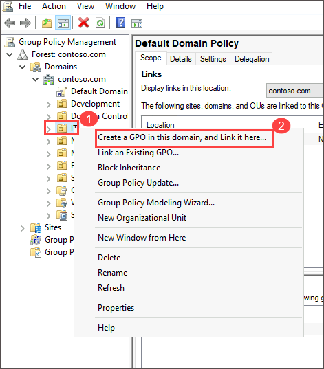

1. In the **New GPO** dialog box, in the **Name** text box, enter **CredentialGuard_GPO**, and then select **OK**.

    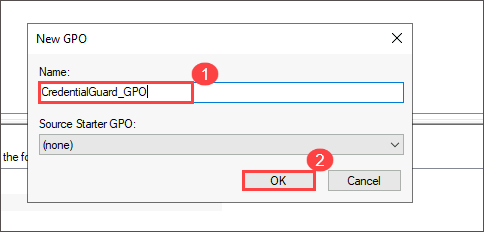

1. In the **Group Policy Management** window, expand **IT**, right-click or access the **context** menu for **CredentialGuard_GPO**, and then select **Edit**.

   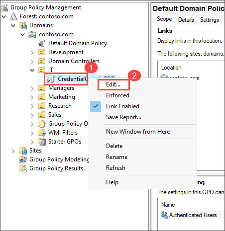

1. In the **Group Policy Management Editor**, expand **Computer Configuration\\Policies\\Administrative Templates\\System\\Device Guard** and select Device Guard.

   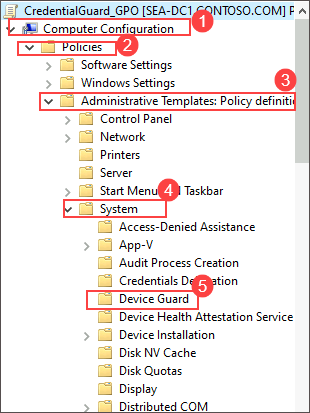

1. Select **Turn On Virtualization Based Security**, and then select the **policy setting** link.
   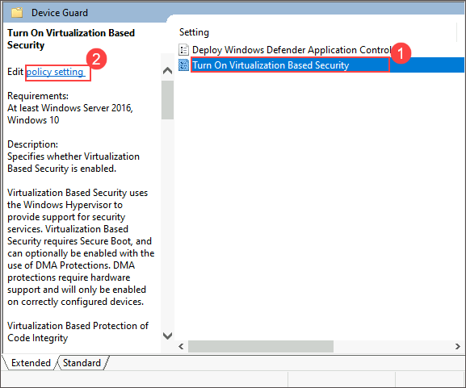

1. In the **Turn On Virtualization Based Security** window, select the **Enabled** option.

1. In the **Select Platform Security Level** drop-down list, ensure that the **Secure Boot and DMA Protection** entry is selected.

1. In the **Credential Guard Configuration** drop-down list, select the **Enabled with UEFI lock** entry.

1. In the **Secure Launch Configuration** drop-down list, select the **Enabled** entry, and then select **OK**.

    

1. Close the **Group Policy Management Editor** window.

1. Close the **Group Policy Management** console window.

#### Task 2: Enable Windows Defender Credential Guard using the Hypervisor-Protected Code Integrity (HVCI) and Windows Defender Credential Guard hardware readiness tool

1. On **SEA-SVR2**, select **Start**, right-click or access the **context** menu for **Windows PowerShell**, and then select **Run as administrator**.
1. To run the HVCI and Windows Defender Credential Guard hardware readiness tool, at the Windows PowerShell command prompt, enter the following commands, enter **R** Run once at the first prompt, and then press Enter for the rest of the prompts:

   ```powershell
   Set-Location -Path C:\Labfiles\Lab01\
   .\DG_Readiness_Tool.ps1 -Enable -AutoReboot
   ```

1. Wait until the tool completes its run and, when prompted, in the **You're about to be signed out** dialog box, select **Close**.

   > **Note**: The operating system will restart. 

1. Once the restart completes, sign back into **SEA-SVR2** as **CONTOSO\\Administrator**, with the password **Pa55w.rd**.

## Exercise 2: Locating problematic accounts

#### Task 1: Locate and reconfigure domain accounts with non-expiring passwords

1. On **SEA-SVR2**, select **Start**, right-click or access the **context** menu for **Windows PowerShell**, and then select **Run as administrator**.
1. To list Active Directory-enabled user accounts with a non-expiring password, at the Windows PowerShell command prompt, enter the following command and press Enter:

   ```powershell
   Get-ADUser -Filter {Enabled -eq $true -and PasswordNeverExpires -eq $true}
   ```

1. Review the list of user accounts returned.
1. To enable password expiration for all user accounts in the result set, at the Windows PowerShell command prompt, enter the following command and press Enter:

   ```powershell
   Get-ADUser -Filter {Enabled -eq $true -and PasswordNeverExpires -eq $true} | Set-ADUser -PasswordNeverExpires $false
   ```

1. To verify the outcome, rerun the command from step 2 and notice that no results are returned.

#### Task 2: Locate and disable domain accounts that have not been used to sign in for at least 90 days

1. To identify Active Directory user accounts that have not been used to sign in for at least 90 days, at the Windows PowerShell command prompt, enter the following command and press Enter:

   ```powershell
   $days = (Get-Date).AddDays(-90)
   Get-ADUser -Filter {LastLogonTimeStamp -lt $days -and enabled -eq $true} -Properties LastLogonTimeStamp
   ```

   > **Note**: In the lab environment, no results will be returned.

1. To disable Active Directory user accounts that have not been used to sign in for at least 90 days, enter the following command and press Enter:

   ```powershell
   Get-ADUser -Filter {LastLogonTimeStamp -lt $days -and enabled -eq $true} -Properties LastLogonTimeStamp | Disable-ADAccount
   ```

   > **Note**: In the lab environment, no results will be returned.

## Exercise 3: Implementing LAPS

#### Task 1: Prepare computer accounts for implementing LAPS (Local Administrator Password Solution)

1. To create a designated OU and move the **SEA-SVR1** computer account to it, on **SEA-SVR2**, at the Windows PowerShell command prompt, enter the following command and press Enter: 

   ```powershell
   New-ADOrganizationalUnit -Name "Seattle_Servers"
   ```
   ```powershell
   Get-ADComputer SEA-SVR1 | Move-ADObject –TargetPath "OU=Seattle_Servers,DC=Contoso,DC=com"
   ```

1. To install LAPS, at the Windows PowerShell command prompt, enter the following command and press Enter:

   ```powershell
   Msiexec /i C:\Labfiles\Lab01\LAPS.x64.msi
   ```

1. On the **Welcome to the Local Administrator Password Solution Setup Wizard** page of the **Local Administrator Password Solution Setup** wizard, select **Next**.
1. On the **End-User License Agreement** page of the **Local Administrator Password Solution Setup** wizard, select **I accept the terms in the License Agreement**, and then select **Next**.
1. On the **Custom Setup** page of the **Local Administrator Password Solution Setup** wizard, in the drop-down menu next to **Management Tools**, select **Entire feature will be installed on the local hard drive**, and then select **Next**.
   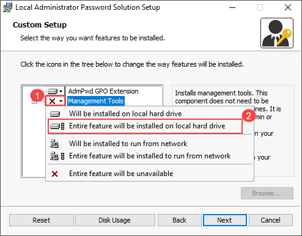

1. On the **Ready to install Local Administrator Password Solution** page of the **Local Administrator Password Solution Setup** wizard, select **Install**. 
1. Once the installation completes, on the final page of the **Local Administrator Password Solution Setup** wizard, select **Finish**.
1. To enable the Windows Defender Firewall with Advanced Security rule that allows incoming Server Message Block (SMB) connections from other domain-joined servers, at the Windows PowerShell command prompt, enter the following commands and, after each, press Enter:

   ```
   $rule = Get-NetFirewallRule | Where-Object DisplayName -eq 'File and Printer Sharing (SMB-In)' 
   $rule | Set-NetFirewallRule -Profile Domain
   $rule | Enable-NetFirewallRule
   ```

   > **Note**: This is required to connect to **SEA-SVR2** from **SEA-SVR1** later in this lab.

#### Task 2: Prepare AD DS for LAPS

1. To prepare the domain for LAPS, on **SEA-SVR2**, at the Windows PowerShell command prompt, enter the following commands, and after each, press Enter:

   ```powershell
   Import-Module admpwd.ps
   Update-AdmPwdADSchema
   Set-AdmPwdComputerSelfPermission -Identity "Seattle_Servers"
   ```

1. On **SEA-SVR2**, in the **Type here to search** text box next to the **Start** button, enter **Group Policy Management**.
1. In the list of results, select **Group Policy Management**.
1. In the **Group Policy Management** console, expand **Forest: contoso.com**, expand **Domains**, expand **contoso.com**, right-click or access the **context** menu for the **Seattle_Servers** OU, and then select **Create a GPO in this domain, and Link it here**.

   

1. In the **New GPO** dialog box, in the **Name** text box, enter **LAPS_GPO**, and then select **OK**.
   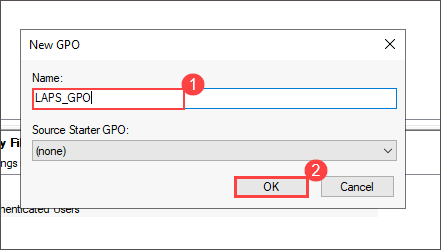
   
1. In the **Group Policy Management** window, under **Seattle_Servers**, right-click or access the **context** menu for **LAPS_GPO**, and then select **Edit**.
1. In the **Group Policy Management Editor** window, under **Computer Configuration**, expand the **Policies** node, expand the **Administrative Templates** node, and then select **LAPS**.
1. Select the **Enable local admin password management** policy, and then select the **policy settings** link.
   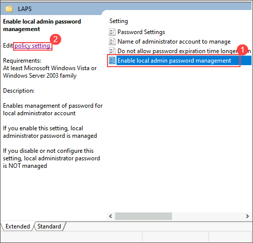

1. In the **Enable local admin password management** window, select **Enabled**, and then select **OK**.
   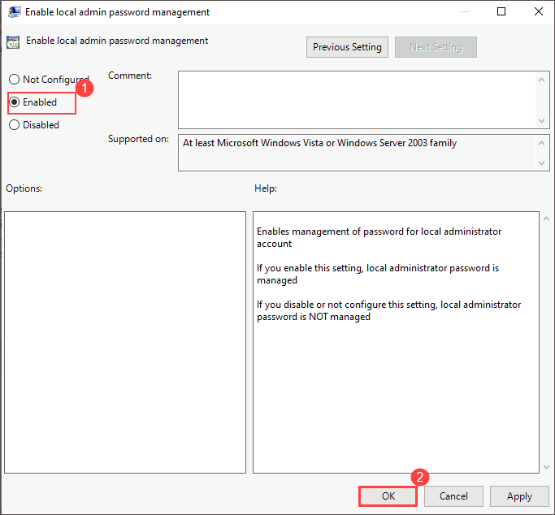

1. Select the **Password Settings** policy, and then select the **policy settings** link.
   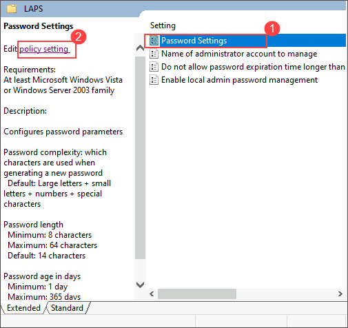

1. In the **Password Settings** policy dialog box, select **Enabled**, and then configure **Password Length** to **20**, Verify that the **Password Age (Days)** is configured to **30**, and then select **OK**.
   

1. Close the Group Policy Management Editor.

#### Task 3: Deploy LAPS client-side extension

1. Switch to the console session to **SEA-SVR1** and then, if needed, sign in as **CONTOSO\\Administrator**, with the password **Pa55w.rd**.

   > **Note:** You will be prompted to change your password, as a result of running in the previous exercise the script that enables password expiration. Choose an arbitrary password and use it throughout the remainder of the lab.

1. Once you sign in, to access the Windows PowerShell command prompt, at the **SConfig** menu prompt, enter **15** and press Enter.
   
   > **Note**: To open Notepad from PowerShell, type **Notepad** and press enter.

1. To install LAPS silently with the default settings, at the Windows PowerShell command prompt, enter the following command and press Enter:

   ```powershell
   Start-Process msiexec.exe -Wait -ArgumentList '/i \\SEA-SVR2.contoso.com\c$\Labfiles\Lab01\LAPS.x64.msi /quiet'
   ```

1. To trigger the processing of Group Policy that will apply **LAPS** settings locally, at the Windows PowerShell command prompt, enter the following command and press Enter:

   ```powershell
   gpupdate /force
   ```

#### Task 4: Verify LAPS

1. Switch to the console session to **SEA-SVR2**.
1. Select **Start**. In the **Start** menu, select **LAPS**, and then select **LAPS UI**.
1. In the **LAPS UI** dialog box, in the **Computer name** text box, enter **SEA-SVR1**, and then select **Search**.

   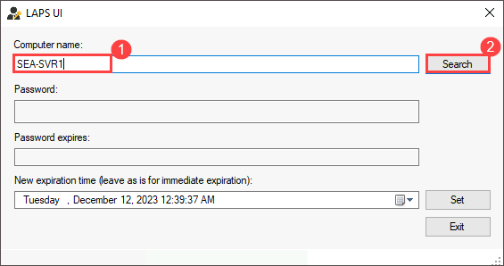

1. Review the **Password** and the **Password expires** values, and then select **Exit**.

1. Switch to the **Windows PowerShell** console and then, to verify the value of the password, at the Windows PowerShell command prompt, enter the following command and press Enter:

   ```powershell
   Get-ADComputer -Identity SEA-SVR1 -Properties ms-Mcs-AdmPwd
   ```

1. Review the password assigned to SEA-SVR1 and note that it matches the one displayed in the **LAPS UI** tool.

   > **Note:** The value of the password is, in this case, enclosed in a pair of braces.

### Review
In this lab, you have completed:
- Configured Windows Defender Credential Guard.
- Implemented LAPS.

### You have successfully completed the lab
