# Lab 03: Implementing failover clustering

## Lab Scenario

As the business of Contoso, Ltd. grows, it's becoming increasingly important that many of the applications and services on its network are always available. Contoso has many services and applications that must be available to internal and external users who work in different time zones around the world. Many of these applications can't be made highly available by using Network Load Balancing (NLB). Therefore, you should use a different technology to make these applications highly available.

As one of the senior network administrators at Contoso, you're responsible for implementing failover clustering on the servers that are running Windows Server to provide high availability for network services and applications. You're also responsible for planning the failover cluster configuration and deploying applications and services on the failover cluster.

>**Note:** An **[interactive lab simulation](https://mslabs.cloudguides.com/guides/AZ-801%20Lab%20Simulation%20-%20Implementing%20Failover%20Clustering)** is available that allows you to click through this lab at your own pace. You may find slight differences between the interactive simulation and the hosted lab, but the core concepts and ideas being demonstrated are the same. 

## Lab Objectives

After completing this lab, you'll be able to:

- Configure a failover cluster.
- Deploy and configure a highly available file server on the failover cluster.
- Validate the deployment of the highly available file server.

## Estimated time: **80 minutes**

## Architecture diagram


## Exercise 1: Configuring iSCSI storage

### Task 1: Install Failover Clustering

1. Connect to **SEA-SVR2**, and then, if needed, sign in as **Contoso\\Administrator** with a password of **Pa55w.rd**.

1. On **SEA-SVR2**, select **Start**, and right-click on **Windows PowerShell**, and select **Run as administrator**.

1. To install the Failover Clustering server feature including the management tools on **SEA-SVR1** and **SEA-SVR2**, at the Windows PowerShell command prompt, enter the following commands, and after entering each command, press Enter:

   ```powershell
   Install-WindowsFeature –Name Failover-Clustering –IncludeManagementTools
   Install-WindowsFeature -ComputerName 'SEA-SVR1.contoso.com' –Name Failover-Clustering –IncludeManagementTools
   ```

   > **Note**: Wait for the installation process to complete. The installation should take about 1 minute.

1. To install iSCSI Target server role service on **SEA-DC1**, at the Windows PowerShell command prompt, enter the following command and press Enter:

   ```powershell
   Install-WindowsFeature -ComputerName 'SEA-DC1.contoso.com' –Name FS-iSCSITarget-Server –IncludeManagementTools
   ```

   > **Note**: Wait for the installation process to complete. The installation should take about 1 minute.

1. Minimize the Windows Powershell window.

### Task 2: Configure iSCSI virtual disks

>**Important:** The lab uses **SEA-DC1**, which serves as an Active Directory Domain Services (AD DS) domain controller to host shared iSCI storage for a Windows Server-based cluster. This is not meant to represent in any way a recommended configuration but rather is done to simplify the lab configuration and minimize the number of lab virtual machines. In any production environment, domain controllers should not be used to host shared storage for failover clusters. Instead, such storage should be hosted on highly available infrastructure. 

1. On **SEA-SVR2**, select **Start**, and right-click on **Windows PowerShell**, and select **Run as administrator**.

1. To establish a PowerShell Remoting session to **SEA-DC1**, in the newly opened **Windows PowerShell** window, enter the following command and press Enter:

   ```powershell
   Enter-PSSession -ComputerName SEA-DC1.contoso.com
   ```

1. To create iSCSI virtual disks on **SEA-DC1**, on **SEA-SVR2**, in the PowerShell Remoting session to **SEA-DC1**, enter the following commands, and after entering each command, press Enter:

   ```powershell
   New-Item -ItemType Directory C:\Storage -Force
   ```
   ```powershell
   New-IscsiVirtualDisk C:\Storage\disk1.VHDX –size 10GB
   ```
   ```powershell
   New-IscsiVirtualDisk C:\Storage\disk2.VHDX –size 10GB
   ```
   ```powershell
   New-IscsiVirtualDisk C:\Storage\disk3.VHDX –size 10GB
   ```
1. Minimize the Windows Powershell window.

1. On **SEA-SVR2**, select **Start**, and right-click on **Windows PowerShell**, and select **Run as administrator**.

1. To establish a PowerShell Remoting session to **SEA-SVR1**, in the newly opened **Windows PowerShell** window, enter the following command, and then press Enter:

   ```powershell
   Enter-PSSession -ComputerName SEA-SVR1.contoso.com
   ```

   > **Note:** At this point, you should have three **Windows PowerShell** windows opened. You will use the first one to run commands locally on **SEA-SVR2**, while using the other two to interact with **SEA-DC1** and **SEA-SVR1**. You can easily recognize each of them by identifying the PowerShell prompt (for the second and third one, the prompt will contain **[SEA-DC1.contoso.com]** and **[SEA-SVR1.contoso.com]** prefix, respectively).

1. To start the Microsoft iSCSI Initiator service on **SEA-SVR2**, at the **Windows PowerShell** prompt providing access to the local session, enter the following commands, and after entering each command, press Enter:

   ```powershell
   Start-Service -ServiceName MSiSCSI
   Set-Service -ServiceName MSiSCSI -StartupType Automatic
   ```

1. To start the Microsoft iSCSI Initiator service on **SEA-SVR1**, switch to the **Windows PowerShell** window hosting PowerShell Remoting session to **SEA-SVR1**, enter the following commands, and after entering each command, press Enter:

   ```powershell
   Start-Service -ServiceName MSiSCSI
   Set-Service -ServiceName MSiSCSI -StartupType Automatic
   ```

1. To create the Microsoft iSCSI Target on **SEA-DC1**, switch to the **Windows PowerShell** window hosting PowerShell Remoting session to **SEA-DC1**, enter the following command, and then press Enter:

   ```powershell
   New-IscsiServerTarget -TargetName “iSCSI-L03” –InitiatorIds “IQN:iqn.1991-05.com.microsoft:sea-svr1.contoso.com","IQN:iqn.1991-05.com.microsoft:sea-svr2.contoso.com"
   ```

## Exercise 2: Configuring a failover cluster

### Task 1: Connect clients to the iSCSI targets

1. To mount the iSCSI disks on **SEA-DC1**, from **SEA-SVR2**, in the **Windows PowerShell** window hosting PowerShell Remoting session to **SEA-DC1**, enter the following commands, and after entering each command, press Enter:

   ```powershell
   Add-IscsiVirtualDiskTargetMapping -TargetName “iSCSI-L03” -DevicePath “C:\Storage\Disk1.VHDX”
   Add-IscsiVirtualDiskTargetMapping -TargetName “iSCSI-L03” -DevicePath “C:\Storage\Disk2.VHDX”
   Add-IscsiVirtualDiskTargetMapping -TargetName “iSCSI-L03” -DevicePath “C:\Storage\Disk3.VHDX”
   ```

1. To connect to the iSCSI Target hosted on **SEA-DC1** from **SEA-SVR2**, switch to the **Windows PowerShell** prompt providing access to the local session, enter the following commands, and after entering each command, press Enter:

   ```powershell
   New-iSCSITargetPortal –TargetPortalAddress SEA-DC1.contoso.com  
   Connect-iSCSITarget –NodeAddress iqn.1991-05.com.microsoft:sea-dc1-iSCSI-L03-target
   Get-iSCSITarget | fl
   ```

   > **Note:** Verify that after you run the last command, the value for the *IsConnected* variable is True.

1. To connect to the iSCSI Target hosted on **SEA-DC1** from **SEA-SVR1**, switch to the Windows PowerShell window hosting PowerShell Remoting session to **SEA-SVR1**, enter the following commands, and after entering each command, press Enter:

   ```powershell
   New-iSCSITargetPortal –TargetPortalAddress SEA-DC1.contoso.com 
   Connect-iSCSITarget –NodeAddress iqn.1991-05.com.microsoft:sea-dc1-iSCSI-L03-target
   Get-iSCSITarget | fl
   ```

   > **Note:** Verify that after you run the last command, the value for the *IsConnected* variable is True.

### Task 2: Initialize the disks

1. To list the disks on **SEA-SVR2**, switch to the Windows PowerShell prompt providing access to the local session, enter the following command, and then press Enter:

   ```powershell
   Get-Disk
   ```

   > **Note:** Ensure that the three iSCSI disks are listed with the **Offline** operational status. These should be disks with numbers 2, 3, and 4.

1. To initialize the disks, at the Windows PowerShell prompt providing access to the local session, enter the following commands, and after entering each command, press Enter:

   ```powershell
   Get-Disk | Where OperationalStatus -eq 'Offline' | Initialize-Disk -PartitionStyle MBR
   New-Partition -DiskNumber 2 -Size 5gb -AssignDriveLetter
   New-Partition -DiskNumber 3 -Size 5gb -AssignDriveLetter
   New-Partition -DiskNumber 4 -Size 5gb -AssignDriveLetter
   Format-Volume -DriveLetter E -FileSystem NTFS
   Format-Volume -DriveLetter F -FileSystem NTFS
   Format-Volume -DriveLetter G -FileSystem NTFS
   ```

   > **Note:** Verify the disk numbers match the previous command output before running the commands. Verify that each command completed successfully.

### Task 3: Create a failover cluster

1. To create a failover cluster, on **SEA-SVR2**, at the Windows PowerShell prompt providing access to the local session, enter the following command, and then press Enter:

   ```powershell
   New-Cluster -Name SEA-CL03 -Node SEA-SVR2.contoso.com -StaticAddress 172.16.10.125
   ```

   > **Note:** The command should return the name of the newly created cluster (**SEA-CL03**). 

1. To add **SEA-SVR1** as another node to the newly created cluster, on **SEA-SVR2**, at the Windows PowerShell prompt providing access to the local session, enter the following command, and then press Enter:

   ```powershell
   Add-ClusterNode -Cluster SEA-CL03 -Name SEA-SVR1.contoso.com
   ```

   > **Note:** Verify that the command completed successfully.

## Exercise 3: Deploying and configuring a highly available file server

### Task 1: Add the file server application to the failover cluster

1. On **SEA-SVR2**, select **Start**, in the **Start** menu, select **Server Manager**, and then, in **Server Manager**, select **Failover Cluster Manager** in the **Tools** menu.

        

   > **Note:** **Failover Cluster Manager** console will be automatically connected to **SEA-CL03** because **SEA-SVR2** is one of the cluster nodes.

1. Expand the **SEA-CL03.contoso.com** node, select **Roles** and verify that the cluster does not host any roles at this point.

    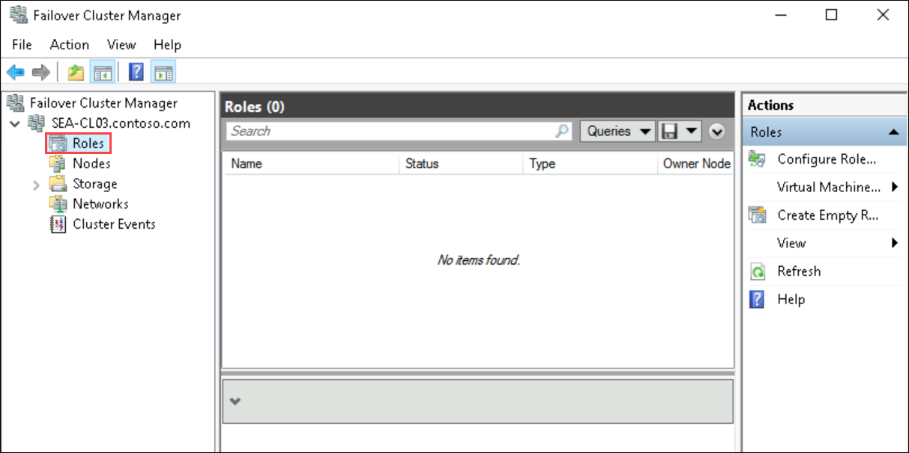 

1. Select the **Nodes** node and verify that the **SEA-SVR1** and **SEA-SVR2** nodes are displayed with the **Up** status.

     

1. Expand the **Storage** node and select **Disks**. Notice that three cluster disks are displayed with the **Online** status.

    

1. On the **Failover Cluster Manager** page, right-click or access the context menu for **Roles**, and then select **Configure Role**. This will start **High Availability Wizard**.

   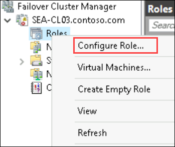 

1. On the **Before You Begin** page of **High Availability Wizard**, select **Next**.

   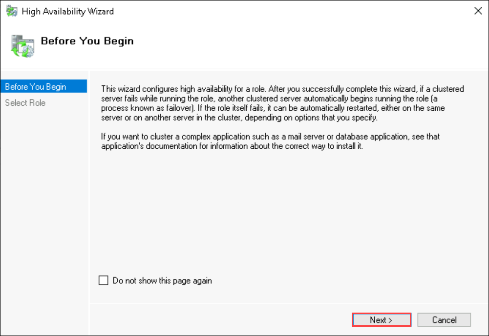 

1. On the **Select Role** page of **High Availability Wizard**, select **File Server**, and then select **Next**.

   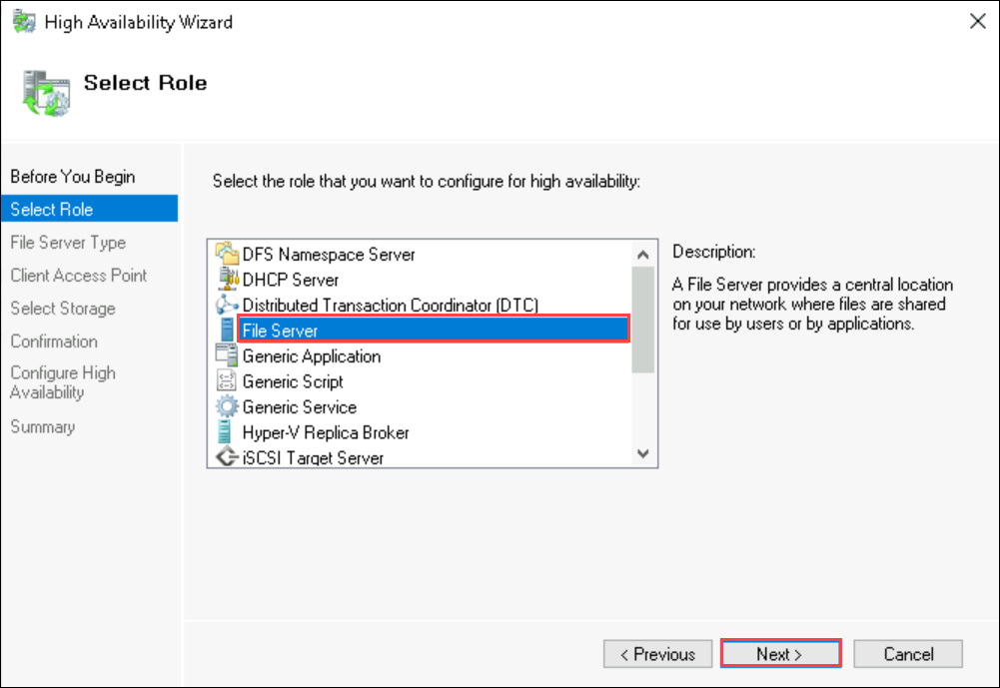 

1. On the **File Server Type** page of **High Availability Wizard**, ensure that the **File Server for general use** option is selected, and then select **Next**.

   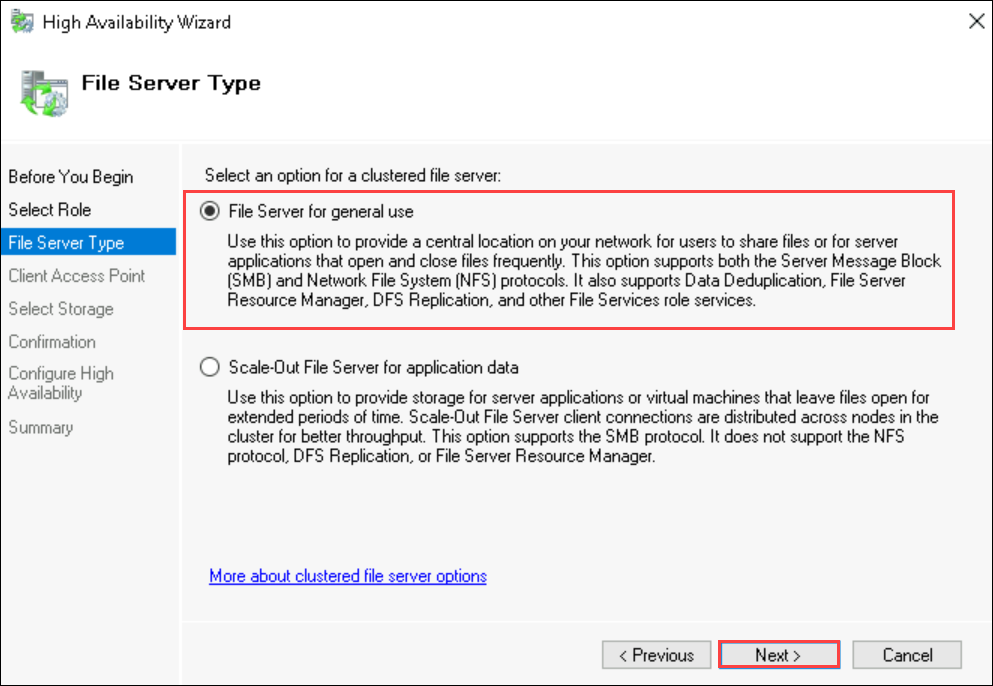 

1. On the **Client Access Point** page of **High Availability Wizard**, in the **Name** box, enter **FSCluster**.

1. In the **Address** box, enter **172.16.10.130**, and then select **Next**.

    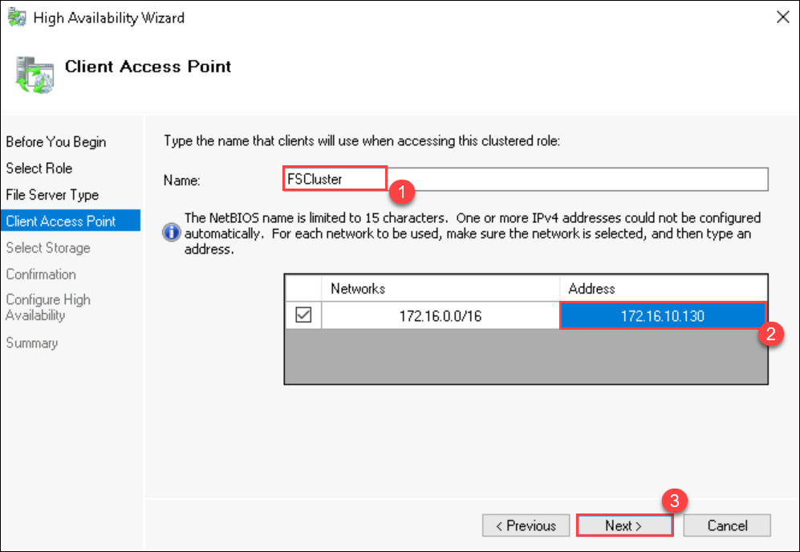 

1. On the **Select Storage** page of **High Availability Wizard**, select **Cluster Disk 1** and **Cluster Disk 2**, and then select **Next**.

   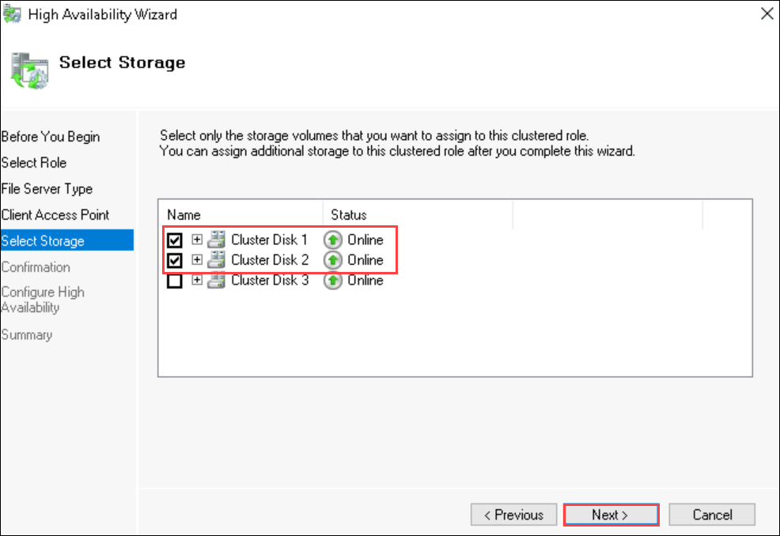 

1. On the **Confirmation** page of **High Availability Wizard**, select **Next**.

   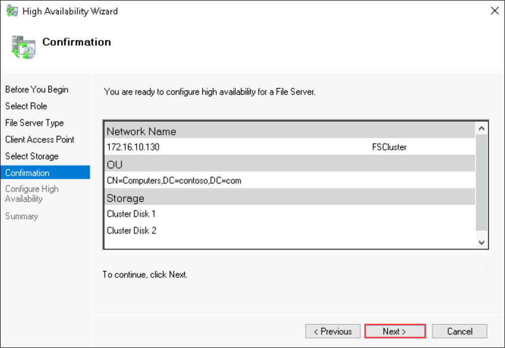 

1. On the **Summary** page of **High Availability Wizard**, select **Finish**.

     

   > **Note:** In the **Storage** node, with the **Disks** node selected, verify that three cluster disks are online. **Cluster Disk 1** and **Cluster Disk 2** should be assigned to **FSCluster**.

      

#### Task 2: Add a shared folder to a highly available file server

1. On **SEA-SVR2**, in **Failover Cluster Manager**, select **Roles**, select **FSCluster**, and then in the Actions pane, select **Add File Share**. 

    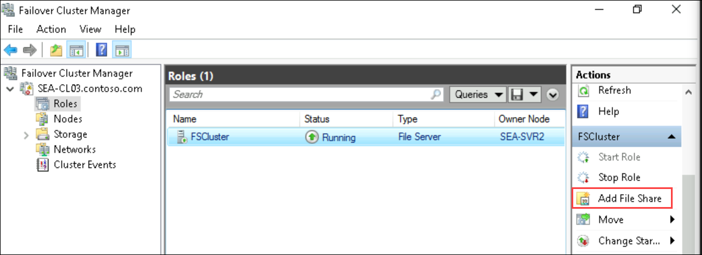 

   > **Note:** This will start the **New Share Wizard**.

1. On the **Select Profile** page, ensure that the **SMB Share - Quick** profile is selected, and then select **Next**.

    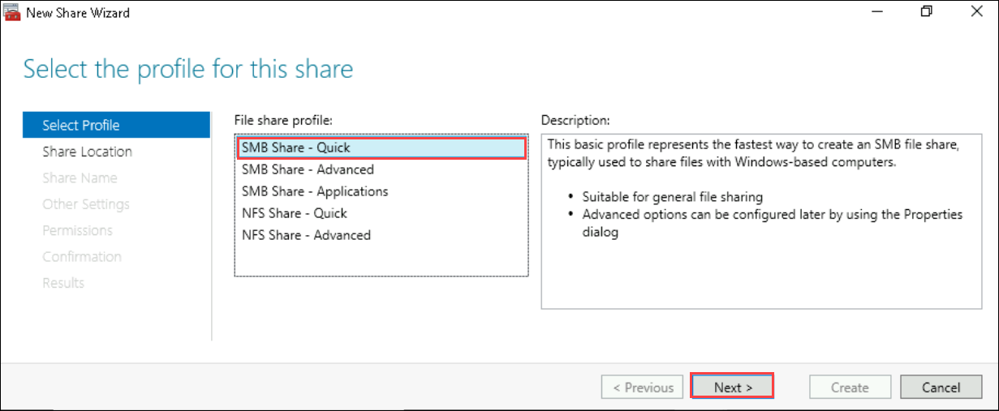 

1. On the **Share Location** page, select **Next**.

1. On the **Share Name** page, enter **Docs** for the share name, and then select **Next**.

    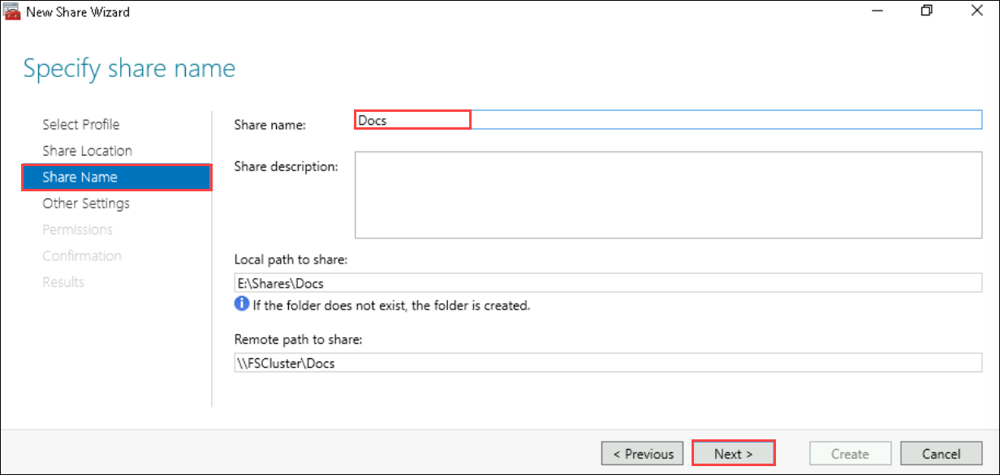 

1. On the **Other Settings** page, select **Next**.

1. On the **Permissions** page, select **Next**.

1. On the **Confirmation** page, select **Create**.

     

1. On the **View results** page, select **Close**.

    

### Task 3: Configure the failover and failback settings

1. **On SEA-SVR2**, in the **Failover Cluster Manager** console, with the **FSCluster** selected in the **Roles** node, in the Actions pane, select **Properties**.

    

1. Select the **Failover** tab, and then select the **Allow failback** option.

1. Select the **Failback between** option, and then enter the following values:

   - **4** in the first text box
   - **5** in the second text box.

      

1. Select the **General** tab.

1. In the **Preferred owners** section, ensure that **SEA-SVR1** is listed as the first entry, and then select **OK**.

   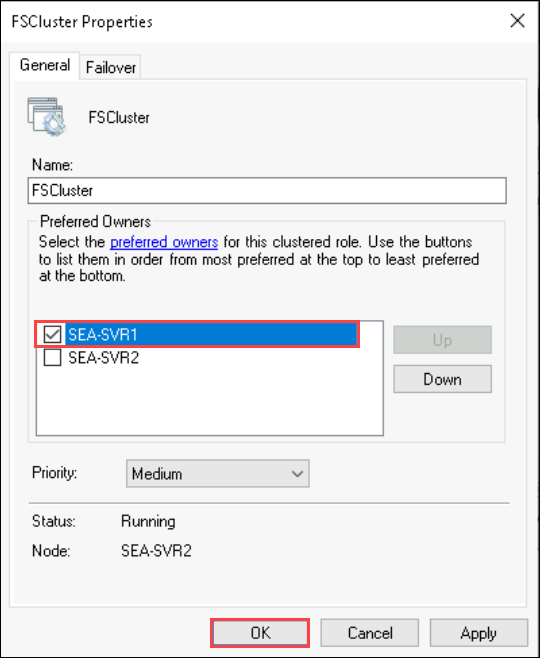 

## Exercise 4: Validating the deployment of the highly available file server

### Task 1: Validate the highly available file server deployment

1. On **SEA-SVR2**, open File Explorer and browse to the **\\\\FSCluster\\Docs** folder.

   >**Note:** In File Explorer, ensure that you are in **Quick access**. Select the **Quick access** path, replace it with **\\FSCluster\Docs**, and press **Enter**.

1. Inside the **Docs** folder, right-click or access the context menu in an empty area of the folder, select **New**, and then select **Text Document**.

     

1. To accept the default name of the document as **New Text Document.txt**, press Enter.

1. On **SEA-SVR2**, switch to the **Failover Cluster Manager** console, right-click or access the context menu for **FSCluster**, select **Move**, select **Select Node**.

   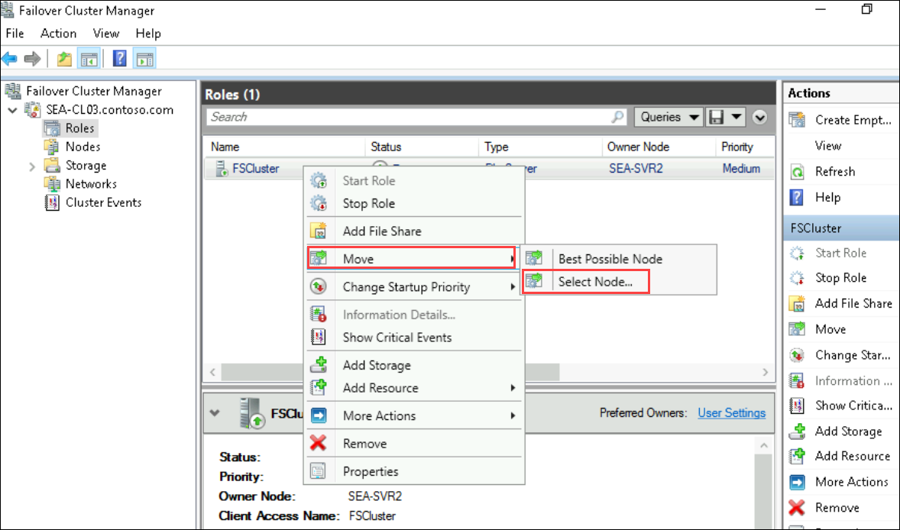 

1. Select **SEA-SVR1**, and then select **OK**.

   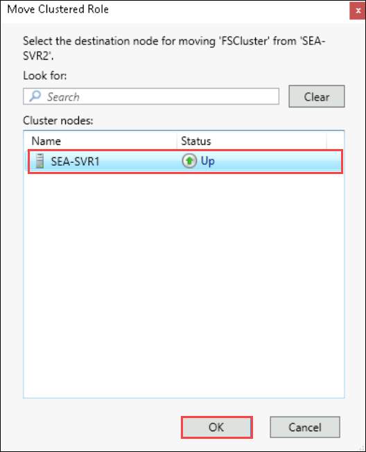 

1. On **SEA-SVR2**, switch back to File Explorer and verify that you can still access the content of the **\\\\FSCluster\\Docs** folder.

### Task 2: Validate the failover and quorum configuration for the File Server role

1. On **SEA-SVR2**, switch to the **Failover Cluster Manager** console and identify the current owner of the **FSCluster** role.

     

1. Select **Nodes**, and then right-click or access the context menu of the node you identified in the previous step.

1. In the context menu, select **More Actions**, and then select **Stop Cluster Service**.

    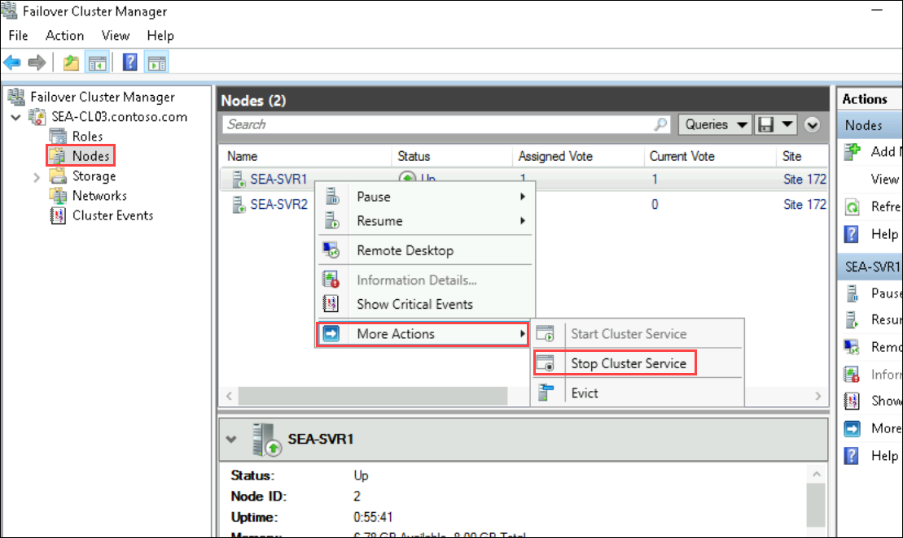 

1. Switch to File Explorer and verify that you can still access the content of **\\\\FSCluster\\Docs** folder.

1. Switch to the **Failover Cluster Manager** console, and then, right-click or access the context menu of the node with the **Down** status.

    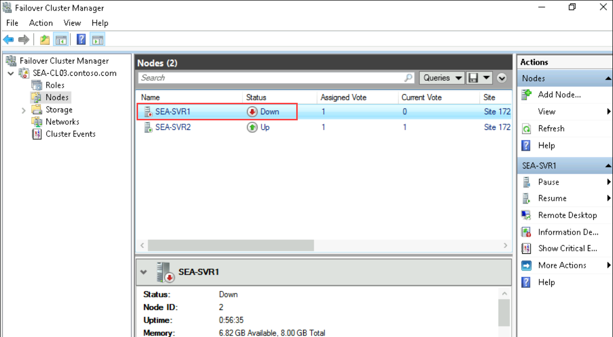 

1. In the context menu, select **More Actions**, and then select **Start Cluster Service**.

   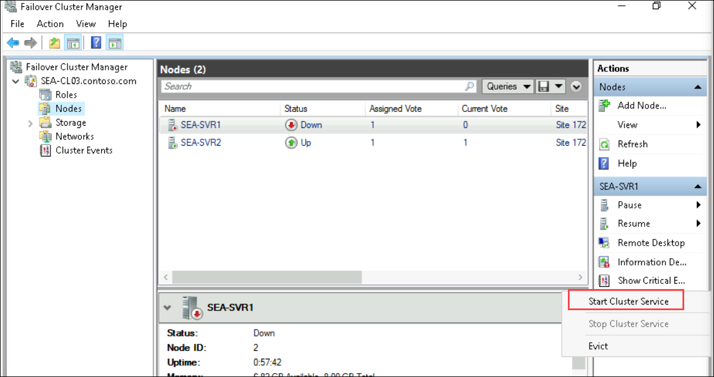 

1. In the **Failover Cluster Manager** console, right-click or access the context menu for the **SEA-CL03.Contoso.com** cluster, select **More Actions**, and then select **Configure Cluster Quorum Settings**. This will start the **Configure Cluster Quorum Wizard**.

    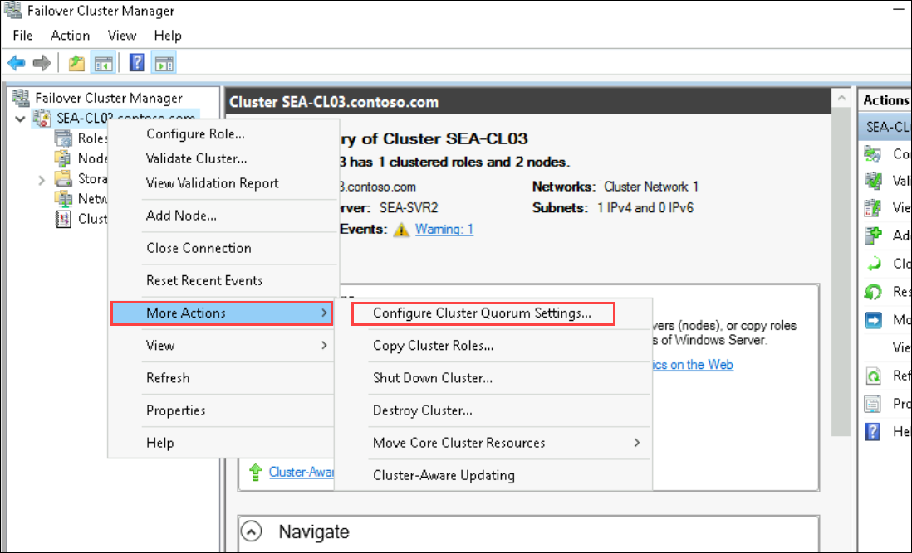 

1. On the **Before You Begin** page, select **Next**.

1. On the **Select Quorum Configuration Option** page, ensure that the **Use default quorum configuration** option is selected, and then select **Next**.

    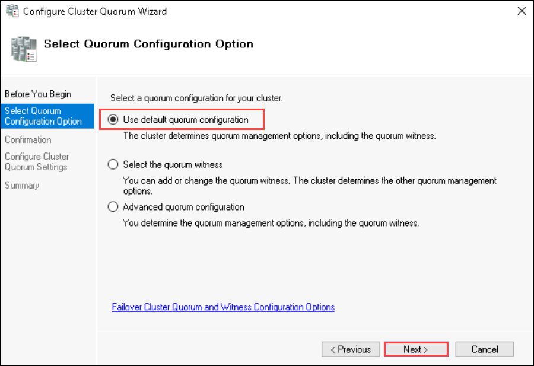 

1. On the **Confirmation** page, note that, by default, **Cluster Disk 3** is selected as the **Disk Witness**, and select **Next**.

   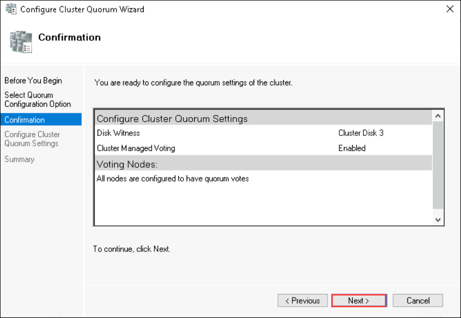 

1. On the **Summary** page, select **Finish**.

1. In the **Failover Cluster Manager** console, browse to the **Disks** node, select **Cluster Disk 3** configured as the disk witness, and then, in the Actions pane, select **Take Offline**.

     

1. When prompted for confirmation, select **Yes**.

1. Switch to File Explorer and verify that you can still access the content of the **\\\\FSCluster\\Docs** folder.

1. Switch to the **Failover Cluster Manager** console, and then, in the list of disks within the **Disks** node, select **Cluster Disk 3** configured as the disk witness, and then, in the Actions pane, select **Bring Online**.

   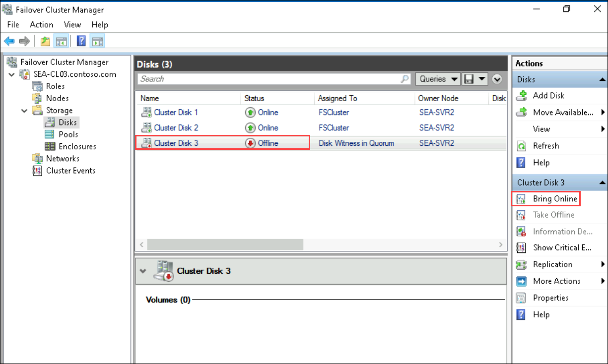  

## Review

In this lab, you have completed the following:

- Configuration of iSCSI storage
- Configuration of  a failover cluster
- Deployment and configuration of a highly available file server
- Validate the deployment of the highly available file server

## You have successfully completed the lab.

