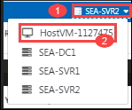
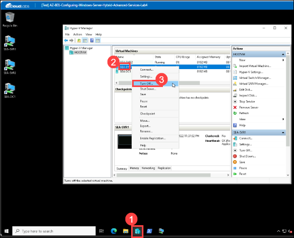
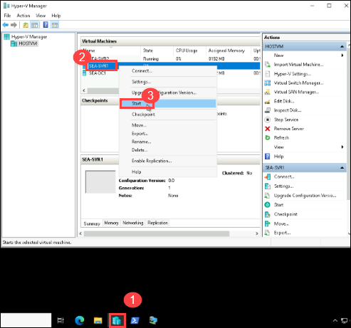

# Lab 04: Implementing Hyper-V Replica and Windows Server Backup

**Note:** An **[interactive lab simulation](https://mslabs.cloudguides.com/guides/AZ-801%20Lab%20Simulation%20-%20Implementing%20Hyper-V%20Replica%20and%20Windows%20Server%20Backup)** is available that allows you to click through this lab at your own pace. You may find slight differences between the interactive simulation and the hosted lab, but the core concepts and ideas being demonstrated are the same. 

## Lab Objectives

After completing this lab, you'll be able to:

- Implement Hyper-V Replica.
- Implement backup and restore with Windows Server Backup.

## Exercise1: Implementing Hyper-V Replica

#### Task 1: Install and configure Hyper-V Replica

1. Connect to **SEA-SVR2**, and then, if needed, sign in as **Contoso\\Administrator** with a password of **Pa55w.rd**.
1. On **SEA-SVR2**, select **Start**, and then select **Windows PowerShell (Admin)**.
1. To identify the status of the Windows Defender Firewall with Advanced Security **Hyper-V Replica HTTP Listener (TCP-In)** rule on **SEA-SVR2**, at the Windows PowerShell prompt, enter the following command and press Enter:

   ```powershell
   Get-NetFirewallRule -DisplayName 'Hyper-V Replica HTTP Listener (TCP-In)'
   ```

1. To enable the Windows Defender Firewall with Advanced Security **Hyper-V Replica HTTP Listener (TCP-In)** rule on **SEA-SVR2**, enter the following command and press Enter:

   ```powershell
   Enable-NetFirewallRule -DisplayName 'Hyper-V Replica HTTP Listener (TCP-In)'
   ```

1. To configure **SEA-SVR2** as a Replica server for **Hyper-V Replica**, enter the following commands, and after entering each command, press Enter:

   ```powershell
   New-Item -ItemType Directory -Path C:\ReplicaStorage -Force
   Set-VMReplicationServer -ReplicationEnabled $true -AllowedAuthenticationType Kerberos -KerberosAuthenticationPort 8080 -ReplicationAllowedFromAnyServer $true -DefaultStorageLocation C:\ReplicaStorage
   ```

1. To verify that **SEA-SVR2** is configured as a Replica server for **Hyper-V Replica**, enter the following command and press Enter:

   ```powershell
   Get-VMReplicationServer
   ```
  
   > **Note**: Verify that the output of the command includes the following settings:

   - **RepEnabled: True**
   - **AuthType: Kerb**
   - **KerAuthPort: 8080**
   - **CertAuthPort: 443**
   - **AllowAnyServer: True**

1. To identify the virtual machines present on **SEA-SVR2**, enter the following command and press Enter:

   ```powershell
   Get-VM
   ```

   > **Note**: Verify that the output of the command includes **SEA-CORE1**. 

   > **Note**: Leave the **Administrator: Windows PowerShell** window open.

1. To open another **Administrator: Windows PowerShell** window, on **SEA-SVR2**, select **Start** and select **Windows PowerShell (Admin)**.
1. To establish a PowerShell Remoting session to **SEA-SVR1**, in the newly opened Windows PowerShell window, enter the following command, and then press Enter:

   ```powershell
   Enter-PSSession -ComputerName SEA-SVR1.contoso.com
   ```
 
   > **Note**: You can recognize the PowerShell Remoting session based on the PowerShell prompt that contains, in this case, the **[SEA-SVR1.contoso.com]** prefix.

1. To identify the status of the Windows Defender Firewall with Advanced Security **Hyper-V Replica HTTP Listener (TCP-In)** rule on **SEA-SVR1**, in the Windows PowerShell window hosting the PowerShell Remoting session to **SEA-SVR1**, enter the following command, and press Enter:

   ```powershell
   Get-NetFirewallRule -DisplayName 'Hyper-V Replica HTTP Listener (TCP-In)'
   ```

   > **Note**: Review the output and verify that the **Enabled** property is set to **False**. To use **Hyper-V Replica**, you need to enable this firewall rule.

1. To enable the Windows Defender Firewall with Advanced Security **Hyper-V Replica HTTP Listener (TCP-In)** rule on **SEA-SVR1**, in the Windows PowerShell window hosting the PowerShell Remoting session to **SEA-SVR1**, enter the following command and press Enter:

   ```powershell
   Enable-NetFirewallRule -DisplayName 'Hyper-V Replica HTTP Listener (TCP-In)'
   ```

1. To configure **SEA-SVR1** as a Replica server for **Hyper-V Replica**, in the Windows PowerShell window hosting the PowerShell Remoting session to **SEA-SVR1**, enter the following commands, and after entering each command, press Enter:

   ```powershell
   New-Item -ItemType Directory -Path C:\ReplicaStorage -Force
   Set-VMReplicationServer -ReplicationEnabled $true -AllowedAuthenticationType Kerberos -ReplicationAllowedFromAnyServer $true -DefaultStorageLocation C:\ReplicaStorage
   ```

   > **Note**: Leave the second **Administrator: Windows PowerShell** window open.

#### Task 2: Configure Hyper-V replication

1. On **SEA-SVR2**, switch to the **Administrator: Windows PowerShell** window displaying the local PowerShell session.
1. To enable replication of the virtual machine **SEA-CORE1** from **SEA-SVR2** to **SEA-SVR1**, on **SEA-SVR2**, at the Windows PowerShell prompt of the local session, enter the following command and press Enter:

   ```powershell
   Enable-VMReplication SEA-CORE1 -ReplicaServerName SEA-SVR1.contoso.com -ReplicaServerPort 80 -AuthenticationType Kerberos -ComputerName SEA-SVR2.contoso.com
   ```

1. To start replication of the virtual machine **SEA-CORE1** from **SEA-SVR2** to **SEA-SVR1**, on **SEA-SVR2**, enter the following command and press Enter:

   ```powershell
   Start-VMInitialReplication SEA-CORE1
   ```

1. To identify status of replication of the virtual machine **SEA-CORE1** from **SEA-SVR2** to **SEA-SVR1** was successfully started, on **SEA-SVR2**, enter the following command and press Enter:

   ```powershell
   Get-VMReplication
   ```

   > **Note**: In the output of the command, identify the **State** value and verify it is listed as **InitialReplicationInProgress**. Wait for about 5 minutes, rerun the same command, and verify that the **State** value changed to **Replicating**. Wait until this happens before you proceed to the next steps. In addition, ensure that **Primary server** is listed as **SEA-SVR2** and **ReplicaServer** as **SEA-SVR1**.

1. On **SEA-SVR2**, switch to the **Administrator: Windows PowerShell** window displaying the PowerShell Remoting session to **SEA-SVR1**.
1. To verify that a replica of **SEA-CORE1** is present on **SEA-SVR1**, in the Windows PowerShell window hosting the PowerShellRemoting session to **SEA-SVR1**, enter the following command and press Enter:

   ```powershell
   Get-VM
   ```

   > **Note**: Ensure that the output of the command lists **SEA-CORE1** and the replication has completed. This might take 5-10 minutes to replicate.

   > **Note**: Leave both Windows PowerShell sessions open.

#### Task 3: Validate a failover

1. On **SEA-SVR2**, switch to the **Administrator: Windows PowerShell** window displaying the local PowerShell session.
1. To prepare for a failover of the **SEA-CORE1** virtual machine to **SEA-SVR1**, on **SEA-SVR2**, in the Windows PowerShell window hosting the local session, enter the following command and press Enter:

   ```powershell
   Start-VMFailover -Prepare -VMName SEA-CORE1 -ComputerName SEA-SVR2.contoso.com
   ```

   > **Note**: When prompted, enter **Y**, and then press Enter. This command prepares for the planned failover of **SEA-CORE1** by triggering replication of any pending changes.

1. On **SEA-SVR2**, switch to the **Administrator: Windows PowerShell** window displaying the PowerShell Remoting session to **SEA-SVR1**.
1. To initiate a failover of the **SEA-CORE1** virtual machine to **SEA-SVR1**, on **SEA-SVR2**, in the Windows PowerShell window hosting the PowerShell Remoting session to **SEA-SVR1**, enter the following command and press Enter:

   ```powershell
   Start-VMFailover -VMName SEA-CORE1 -ComputerName SEA-SVR1.contoso.com
   ```

   > **Note**: When prompted, enter **Y**, and then press Enter.

1. To configure the replica VM as the primary VM, on **SEA-SVR2**, in the Windows PowerShell window hosting the PowerShell Remoting session to **SEA-SVR1**, enter the following command and press Enter:

   ```powershell
   Set-VMReplication -Reverse -VMName SEA-CORE1 -ComputerName SEA-SVR1.contoso.com
   ```
1. Switch to **HOSTVM-<inject key="DeploymentID" enableCopy="false"/>** from the dropdown as shown below.

   

1. Click on the Hyper-V manager and right click on **SEA-SVR1** VM and select **Turn off**.

   

1. Right click on Start and select **Windows Powershell(Admin)** and enter the following command and press Enter:

   ```powershell
   Set-VMProcessor -VMName SEA-SVR1 -ExposeVirtualizationExtensions $true
   ```
1. 1. Click on the Hyper-V manager and right click on **SEA-SVR1** VM and select **Start** and notice that the VM state turns to **Running**.

   

1. To start the newly designated primary VM on **SEA-SVR1**, Switch to **SEA-SVR2**, and in the Windows PowerShell window hosting the PowerShell Remoting session to **SEA-SVR1**, enter the following command and press Enter:

   ```powershell
   Start-VM -VMName SEA-CORE1 -ComputerName SEA-SVR1.contoso.com
   ```

1. To verify that the VM was successfully started, on **SEA-SVR2**, in the Windows PowerShell window hosting the PowerShell Remoting session to **SEA-SVR1**, enter the following command and press Enter:

   ```powershell
   Get-VM
   ```

   > **Note**: In the result table, verify that **State** is listed as **Running**.

1. To identify status of replication of the virtual machine **SEA-CORE1** from **SEA-SVR1** to **SEA-SVR2**, on **SEA-SVR2**, in the Windows PowerShell window hosting the PowerShell Remoting session to **SEA-SVR1**, enter the following command and press Enter:

   ```powershell
   Get-VMReplication
   ```

   > **Note**: In the output of the command, identify the **State** value and verify it is listed as **Replicating**. In addition, ensure that **Primary server** is listed as **SEA-SVR1** and **ReplicaServer** is listed as **SEA-SVR2**.

1. To stop the replicating VM on the primary server, on **SEA-SVR2**, in the Windows PowerShell window hosting the PowerShell Remoting session to **SEA-SVR1**, enter the following command and press Enter:

   ```powershell
   Stop-VM -VMName SEA-CORE1
   ```

1. Leave both Windows PowerShell windows open.

   > **Note**: If you want to verify the results of this exercise by using graphical tools, you can use Hyper-V Manager on **SEA-SVR2**, and then add the **SEA-SVR1** and **SEA-SVR2** servers to the **Hyper-V** console. You can then verify that the **SEA-CORE1** VM exists on both **SEA-SVR1** and **SEA-SVR2** and that replication is running from **SEA-SVR2** to **SEA-SVR1**.

   > **Congratulations** on completing the task! Now, it's time to validate it. Here are the steps:
   > - Navigate to the Lab Validation Page, from the upper right corner in the lab guide section.
   > - Hit the Validate button for the corresponding task. If you receive a success message, you can proceed to the next task. 
   > - If not, carefully read the error message and retry the step, following the instructions in the lab guide.
   > - If you need any assistance, please contact us at labs-support@spektrasystems.com. We are available 24/7 to help you out.

## Exercise 2: Implementing backup and restore with Windows Server Backup

#### Task1: Configure Windows Server Backup settings

1. On **SEA-SVR2**, open File Explorer by selecting the **File Explorer** icon on the taskbar.
1. In File Explorer, select **Local Disk (C:)** in the **navigation** pane.
1. Right-click or access the context menu in an empty space in the details pane, select **New**, and then select **Folder**. 
1. Name the folder **BackupShare**. Right-click or access the context menu for the **BackupShare** folder, select **Give access to**, and then select **Specific people**.
1. In the **Network access** window, enter **Authenticated Users**, and then select **Add**. In the **Permission Level** column, set the value for **Authenticated Users** to **Read/Write**, select **Share**, and then select **Done**.
1. On **SEA-SVR2**, switch to the **Administrator: Windows PowerShell** window hosting the PowerShellRemoting session to **SEA-SVR1**. 
1. To install the **Windows Server Backup** role on **SEA-SVR1**, on **SEA-SVR2**, in the Windows PowerShell window hosting the PowerShell Remoting session to **SEA-SVR1**, enter the following command and press Enter:

   ```powershell
   Install-WindowsFeature Windows-Server-Backup
   ```

   > **Note**: Wait until the installation completes.

1. To review the capabilities of the **wbadmin** command-line utility, on **SEA-SVR2**, in the Windows PowerShell window hosting the PowerShell Remoting session to **SEA-SVR1**, enter the following command and press Enter:

   ```powershell
   wbadmin /?
   ```

1. To review the capabilities of the Windows PowerShell cmdlets that are included in the **WindowsServerBackup** module, on **SEA-SVR2**, in the Windows PowerShell window hosting the PowerShellRemoting session to **SEA-SVR1**, enter the following command and press Enter:

   ```powershell
   Get-Command -Module WindowsServerBackup -CommandType Cmdlet
   ```

#### Task 2: Perform a backup to a network share

1. To create the folder and files to be backed up on **SEA-SVR1**, on **SEA-SVR2**, in the Windows PowerShell window hosting the PowerShellRemoting session to **SEA-SVR1**, enter the following commands, and after entering each command, press Enter:

   ```powershell
   New-Item -ItemType Directory -Path 'C:\Files' -Force
   fsutil file createnew C:\Files\report1.docx 25432108
   fsutil file createnew C:\Files\report2.docx 25432108
   fsutil file createnew C:\Files\report3.docx 25432108
   fsutil file createnew C:\Files\report4.docx 25432108
   ```

1. To define variables for backup policy and the file path to back up by using Windows Server Backup, on **SEA-SVR2**, in the Windows PowerShell window hosting the PowerShell Remoting session to **SEA-SVR1**, enter the following commands, and after entering each command, press Enter:

   ```powershell
   $policy = New-WBPolicy
   $fileSpec = New-WBFileSpec -FileSpec 'C:\Files'
   ```

1. To define a Windows Server Backup policy that references the variables you defined in the previous step, on **SEA-SVR2**, in the Windows PowerShell window hosting the PowerShell Remoting session to **SEA-SVR1**, enter the following command and press Enter:

   ```powershell
   Add-WBFileSpec -Policy $policy -FileSpec $fileSpec
   ```

1. To configure a backup location on **SEA-SVR2** using the network share you created in the previous task, on **SEA-SVR2**, in the Windows PowerShell window hosting the PowerShell Remoting session to **SEA-SVR1**, enter the following commands, and after entering each command, press Enter (when prompted to sign in, enter the **CONTOSO\\Administrator** username and **Pa55w.rd** password):

   ```powershell
   $cred = Get-Credential
   $networkBackupLocation = New-WBBackupTarget -NetworkPath "\\SEA-SVR2.contoso.com\BackupShare" -Credential $cred
   ```

1. To add the backup location to the backup policy, in the Windows PowerShell window hosting the PowerShell Remoting session to **SEA-SVR1**, enter the following command and press Enter:

   ```powershell
   Add-WBBackupTarget -Policy $policy -Target $networkBackupLocation
   ```

1. To enable Volume Shadow Copy Service, in the Windows PowerShell window hosting the PowerShell Remoting session to **SEA-SVR1**, enter the following command and press Enter:

   ```powershell
   Set-WBVssBackupOptions -Policy $policy -VssCopyBackup
   ```

1. To start a backup job, in the Windows PowerShell window hosting the PowerShell Remoting session to **SEA-SVR1**, enter the following command and press Enter:

   ```powershell
   Start-WBBackup -Policy $policy
   ```

   > **Note**: Wait until the backup completes. This should take about 1 minute.

1. On **SEA-SVR2**, switch to File Explorer, browse to **C:\\BackupShare**, and verify that the folder includes the newly created backup in the **WindowsImageBackup** subfolder.

   > **Congratulations** on completing the task! Now, it's time to validate it. Here are the steps:
   > - Navigate to the Lab Validation Page, from the upper right corner in the lab guide section.
   > - Hit the Validate button for the corresponding task. If you receive a success message, you can proceed to the next task. 
   > - If not, carefully read the error message and retry the step, following the instructions in the lab guide.
   > - If you need any assistance, please contact us at labs-support@spektrasystems.com. We are available 24/7 to help you out.

### Review
In this lab, you have completed:
- Implemented Hyper-V Replica.
- Implemented backup and restore with Windows Server Backup.

### You have successfully completed the lab
