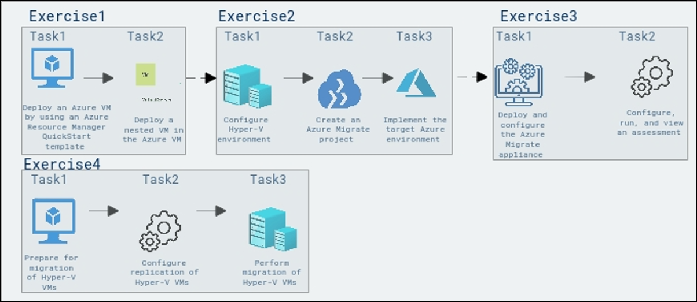
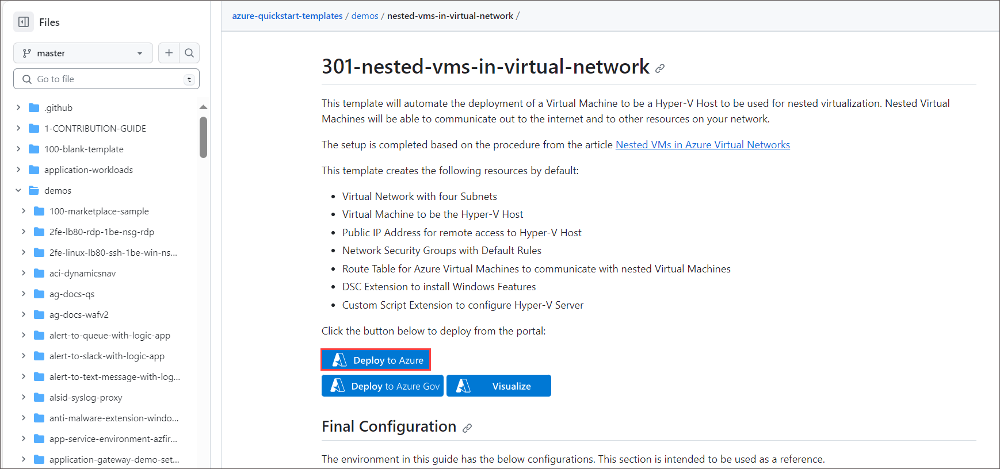
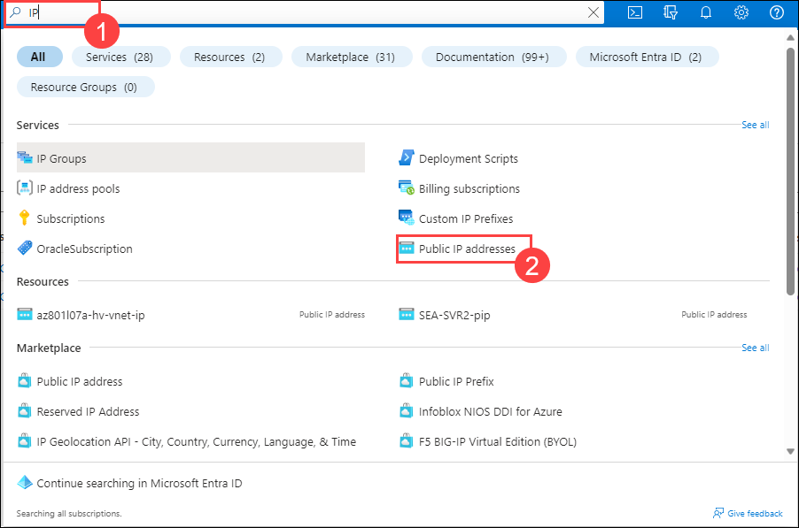
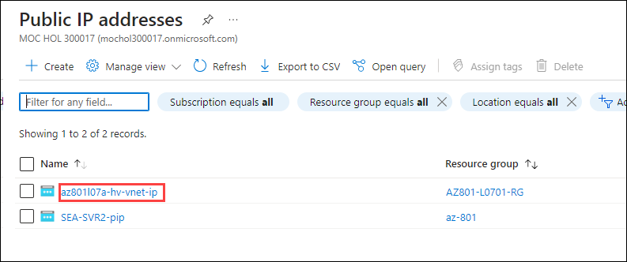
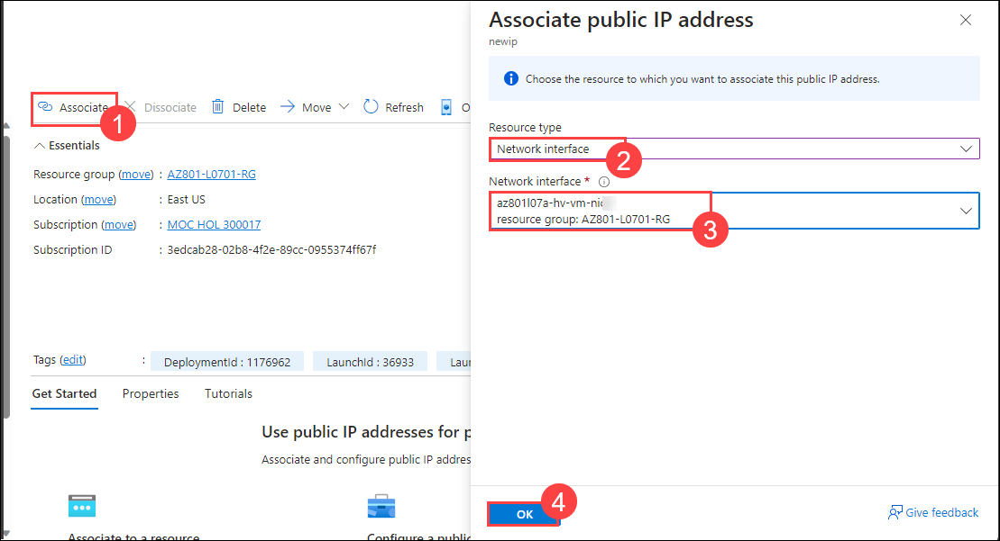
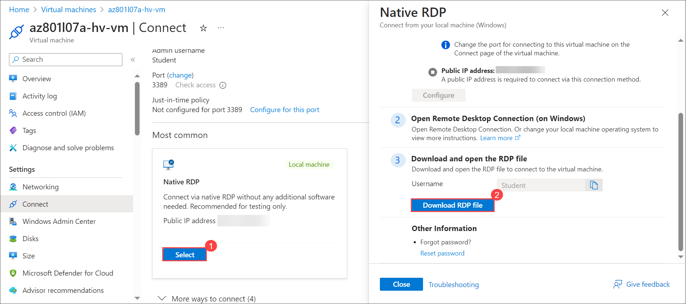
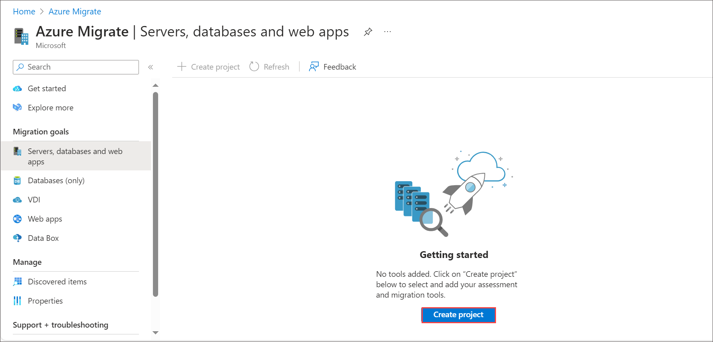
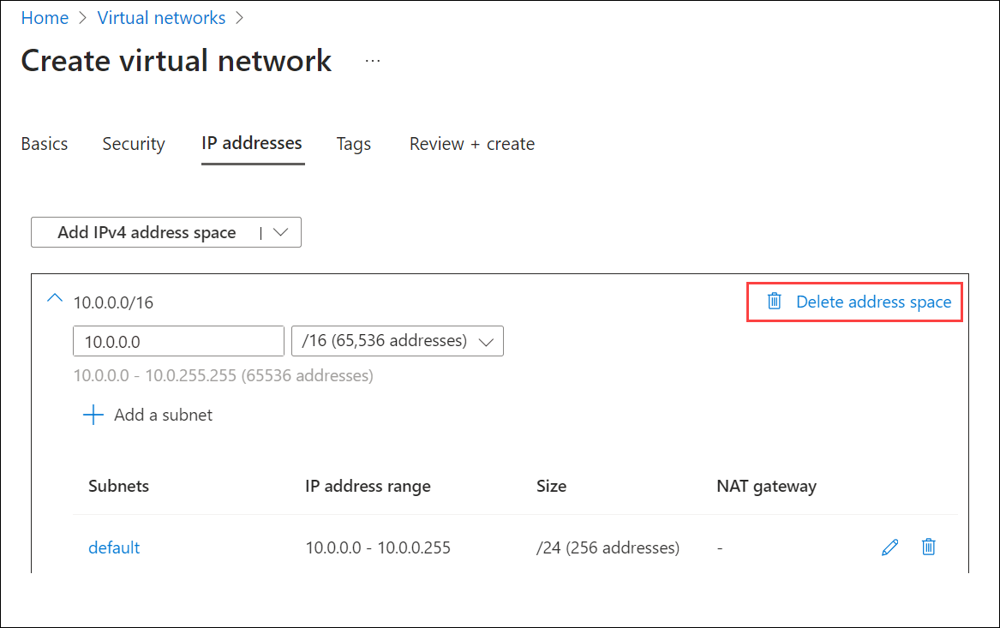

# Lab 07: Migrating Hyper-V VMs to Azure by using Azure Migrate

## Lab scenario

Despite its ambitions to modernize its workloads as part of the migration to Azure, the Adatum Enterprise Architecture team realizes that, due to aggressive timelines, in many cases, it will be necessary to follow the lift-and-shift approach. To simplify this task, the team starts exploring the capabilities of Azure Migrate. Azure Migrate serves as a centralized hub to assess and migrate to Azure on-premises servers, infrastructure, applications, and data.

Azure Migrate provides the following features:

- Unified migration platform: A single portal to start, run, and track your migration to Azure.
- Range of tools: A range of tools for assessment and migration. Tools include Azure Migrate: Server Assessment and Migration and modernization. Azure Migrate integrates with other Azure services and with other tools and independent software vendor (ISV) offerings.
- Assessment and migration: In the Azure Migrate hub, you can assess and migrate:
    - Servers: Assess on-premises servers and migrate them to Azure virtual machines.
    - Databases: Assess on-premises databases and migrate them to Azure SQL Database or to SQL Managed Instance.
    - Web applications: Assess on-premises web applications and migrate them to Azure App Service by using the Azure App Service Migration Assistant.
    - Virtual desktops: Assess your on-premises virtual desktop infrastructure (VDI) and migrate it to Windows Virtual Desktop in Azure.
    - Data: Migrate large amounts of data to Azure quickly and cost-effectively using Azure Data Box products.

While databases, web apps, and virtual desktops are within the scope of the next stage of the migration initiative, the Adatum Enterprise Architecture team wants to start by evaluating the use of Azure Migrate for migrating their on-premises Hyper-V virtual machines to Azure VM.

**Note:** An **[interactive lab simulation](https://mslabs.cloudguides.com/guides/AZ-801%20Lab%20Simulation%20-%20Migrating%20Hyper-V%20VMs%20to%20Azure%20by%20using%20Azure%20Migrate)** is available that allows you to click through this lab at your own pace. You may find slight differences between the interactive simulation and the hosted lab, but the core concepts and ideas being demonstrated are the same. 

## Lab Objectives
  
After completing this lab, you will be able to:

-  Prepare for assessment and migration by using Azure Migrate.
-  Assess Hyper-V for migration by using Azure Migrate.
-  Migrate Hyper-V VMs by using Azure Migrate.

## Estimated Time: 180 minutes

## Architecture diagram



## Exercise 1: Prepare the lab environment

#### Task 1: Deploy an Azure VM by using an Azure Resource Manager QuickStart template

1. On **Lab-VM**, start Microsoft Edge, go to the **[301-nested-vms-in-virtual-network Azure QuickStart template](https://github.com/az140mp/azure-quickstart-templates/tree/master/demos/nested-vms-in-virtual-network)** and select **Deploy to Azure**. (You'll find the button **Deploy to Azure** in the `README.md` file after the list of resources created by the template.) This will automatically redirect the browser to the **Hyper-V Host Virtual Machine with nested VMs** page in the Azure portal.

   
   
1. If prompted, in the Azure portal, sign in by using following credentials:
   
   - Username: <inject key="AzureAdUserEmail"></inject>
  
   - Password: <inject key="AzureAdUserPassword"></inject>
  
1. On the **Hyper-V Host Virtual Machine with nested VMs** page in the Azure portal, specify the following settings (Leave others with their default values.):

   | Setting | Value | 
   | --- | --- |
   | Subscription | the name of the Azure subscription you are using in this lab |
   | Resource group | Select  **AZ801-L0701-RG** |
   | Region | select **<inject key="Region" enableCopy="false"/>** |
   | Virtual Network Name | **az801l07a-hv-vnet** |
   | Host Network Interface1Name | **az801l07a-hv-vm-nic1** |
   | Host Network Interface2Name | **az801l07a-hv-vm-nic2** |
   | Host Virtual Machine Name | **az801l07a-hv-vm** |
   | Host Admin Username | **Student** |
   | Host Admin Password | **Pa55w.rd1234** |

1. On the **Hyper-V Host Virtual Machine with nested VMs** page, select **Review + create** and then select **Create**.

   > **Note**: Wait for the deployment to complete. The deployment might take about 10 minutes.

1. Once deployment is successfully in search bar, search for and select Virtual machine and on virtual machine blade from the list select **az801l07a-hv-vm**.
1. Please follow **1a** or **1b** based on the experience provided in the portal to add inbound port rule.
    * 1a - On **az801l07a-hv-vm** page, under **Settings** section select **Networking** and click on **Add inbound port rule**
    * 1b - On **az801l07a-hv-vm** page, under **Networking** section select **Network settings** and click on **+ create port rule** and from drop down and select **inbound port rule**.(New experience)
1. On **Add inbound security rule** page for **Services** from drop down select **RDP** and click on **Add**.
1. Once deployment is successfully in search bar, search for and select **Public Ip address**.
1. On **Public IP addresses** page, select **+ Create** and on basics tab specify the following (Leave others with their default values.):
   
   | Setting | Value | 
   | --- | --- |
   | Resource group | Select  **AZ801-L0701-RG** |
   | Name |**az801l07a-hv-vnet-ip** |

1. Select **Review + create** and **create**.
1. Search and select **Public IP addresses** from the portal.
   
1. Select **az801l07a-hv-vnet-ip** from the list.
   
1. From the Overview page, select **Associate** and select **Network interface** for Resource type dropdown and select **az801l07a-hv-vm-nic1** from the Network interface dropdown and select **OK**.
      
 
#### Task 2: Deploy a nested VM in the Azure VM

1. In the Azure portal, in the **Search resources, services, and docs** text box, on the toolbar, search for and select **Virtual machines** and then, on the **Virtual machines** page, select **az801l07a-hv-vm**.
1. On the **az801l07a-hv-vm** page, select Connect, under Native RDP click on Select and on Native RDP window select and Download RDP file.
    

1. Open the downloaded file and when prompted, provide the following credentials, and then select **Connect**:

   | Setting | Value | 
   | --- | --- |
   | User Name |**Student** |
   | Password |**Pa55w.rd1234** |

1. Within the Remote Desktop session to **az801l07a-hv-vm**, in the **Server Manager** window, select **Local Server**, select the **On** link next to the **IE Enhanced Security Configuration** label. In the **IE Enhanced Security Configuration** dialog box, select both **Off** options, and then select **OK**.
1. From the Remote Desktop session, open File Explorer and browse to the **F:** drive. Create two folders **F:\\VHDs** and **F:\\VMs**. 
1. Within the Remote Desktop session to **az801l07a-hv-vm**, start Microsoft Edge, and On the Welcome to Microsoft Edge page, select **Start without your data** and on the help for importing Google browsing data page, select the **Continue without this data** button. Then, proceed to select **Confirm and start browsing** on the next page, go to [Windows Server Evaluations](https://www.microsoft.com/en-in/EvalCenter).
1. On start your evaluation today page, select **Windows Server 2022**.
1. On the Windows Server 2022 page, under **Get started for free** select **Download the VHD** and on **Evaluate Windows Server 2022** page provide the requested information for 
   registration and click on **Download now**.

   | Setting        | Value      | 
   | -------------- | ---------- |
   | First Name     |**ODL**     |
   | Last Name      |**User**    |
   | Email          |**<inject key="AzureAdUserEmail"></inject>** |
   | Country/region | Enter your country |
   | Company name   | Contoso |
   | Company size   | 1 |
   | Job Role       | Server Administrator |
   | Phone          | Select your country code and enter phone number |

1. Before downloading the VHD file please change the download location to **F:\VHDs** folder.

   >**Note**: You can change download settings location by navigating to Microsoft edge, select (...) icon at top right of the corner, select **Download** and on **Download** window click on **(...) icon and select 
   **Downloads settings** and in location field click on change to set the location.
   
1. On the **Please select your windows server 2022 download** page, in English united status row, under **VHD download** select **64-bit edition**.

   >**Note**: Wait for download to complete.

1. Within the Remote Desktop session to **az801l07a-hv-vm**, select **Start** menu, search and  select **Hyper-V Manager**. 
1. In the **Hyper-V Manager** console, select the **az801l07a-hv-vm** node. 
1. From the right navigation pane, under **Actions** select **New** and then, in the cascading menu, select **Virtual Machine**. This will start the **New Virtual Machine Wizard**. 
1. On the **Before You Begin** page of the **New Virtual Machine Wizard**, select **Next >**.
1. On the **Specify Name and Location** page of the **New Virtual Machine Wizard**, specify the following settings and select **Next >**:

   | Setting | Value | 
   | --- | --- |
   | Name | **az801l07a-vm1** | 
   | Store the virtual machine in a different location | selected | 
   | Location | **F:\VMs** |

1. On the **Specify Generation** page of the **New Virtual Machine Wizard**, ensure that the **Generation 1** option is selected, and then select **Next >**.
1. On the **Assign Memory** page of the **New Virtual Machine Wizard**, set **Startup memory** to **2048**, and then select **Next >**.
1. On the **Configure Networking** page of the **New Virtual Machine Wizard**, in the **Connection** drop-down list, select **NestedSwitch**, and then select **Next >**.
1. On the **Connect Virtual Hard Disk** page of the **New Virtual Machine Wizard**, select the option **Use an existing virtual hard disk**, set location to the **VHD** file you downloaded to the **F:\VHDs** folder, and then select **Next >**.
1. On the **Summary** page of the **New Virtual Machine Wizard**, select **Finish**.
1. In the **Hyper-V Manager** console, select the newly created virtual machine, right click and then select **Start**. 
1. In the **Hyper-V Manager** console, verify that the virtual machine is running, right click and then select **Connect**. 
1. In the **Virtual Machine Connection** window to **az801l07a-vm1**, on the **Hi there** page, select **Next**. 
1. In the **Virtual Machine Connection** window to **az801l07a-vm1**, on the **License terms** page, select **Accept**. 
1. In the **Virtual Machine Connection** window to **az801l07a-vm1**, on the **Customize settings** page, set the password of the built-in Administrator account to **Pa55w.rd**, and then select **Finish**. 
1. In the **Virtual Machine Connection** window to **az801l07a-vm1**, in the **Action** menu, select first icon **Ctrl + Alt + Delete** and then, when prompted, sign in by using **Pa55w.rd** password.
    
1. In the **Virtual Machine Connection** window to **az801l07a-vm1**, select **Start**. In the **Start** menu, select **Windows PowerShell** and then, in the **Administrator: Windows PowerShell** window, run the following to set the computer name. 

   ```powershell
   Rename-Computer -NewName 'az801l07a-vm1' -Restart
   ```

> **Congratulations** on completing the task! Now, it's time to validate it. Here are the steps:
> - Navigate to the Lab Validation Page, from the upper right corner in the lab guide section.
> - Hit the Validate button for the corresponding task. You can proceed to the next task if you receive a success message.
> - If not, carefully read the error message and retry the step, following the instructions in the lab guide.
> - If you need any assistance, please contact us at labs-support@spektrasystems.com. We are available 24/7 to help you out.

## Exercise 2: Prepare for assessment and migration by using Azure Migrate
  
#### Task 1: Configure Hyper-V environment

1. Navigate back to Remote Desktop session to **az801l07a-hv-vm** and within the Remote Desktop session to **az801l07a-hv-vm**, in the browser window change download location to **Downloads** and go to [https://aka.ms/migrate/script/hyperv](https://aka.ms/migrate/script/hyperv), and download the Azure Migrate configuration PowerShell script.

   >**Note**: The script performs the following tasks:

   >- Checks that you're running the script on a supported PowerShell version
   >- Verifies that you have administrative privileges on the Hyper-V host
   >- Allows you to create a local user account that the Azure Migrate service uses to communicate with the Hyper-V host (This user account is added to **Remote Management Users**, **Hyper-V Administrators**, and **Performance Monitor Users** groups on the Hyper-V host.) 
   >- Checks that the host is running a supported version of Hyper-V, and the Hyper-V role
   >- Enables the WinRM service, and opens ports 5985 (HTTP) and 5986 (HTTPS) on the host (This is required for metadata collection.) 
   >- Enables PowerShell remoting on the host
   >- Checks that the Hyper-V Integration Services is enabled on all VMs managed by the host
   >- Enables CredSSP on the host if needed

1. Within the Remote Desktop session to **az801l07a-hv-vm**, select **Start** and then select **Windows PowerShell ISE** and **Run as Administrator**.
1. In the **Administrator: Windows PowerShell ISE** window, on the console pane, run the following commands to copy the script to the **C:\\Labfiles\\Lab07** folder and remove the Zone.Identifier alternate data stream, which, in this case, indicates that the file was downloaded from the Internet:

   ```powershell
   New-Item -ItemType Directory -Path C:\Labfiles\Lab07 -Force
   Copy-Item -Path "$env:USERPROFILE\Downloads\MicrosoftAzureMigrate-Hyper-V.ps1" -Destination 'C:\Labfiles\Lab07'
   Unblock-File -Path C:\Labfiles\Lab07\MicrosoftAzureMigrate-Hyper-V.ps1
   Set-Location -Path C:\Labfiles\Lab07
   ```

1. In the **Administrator: Windows PowerShell ISE** window, open the **MicrosoftAzureMigrate-Hyper-V.ps1** script residing in the **C:\\Labfiles\\Lab07** folder and run it. When prompted for confirmation, enter **Y** and press Enter, with the exception of the following prompts, in which case, enter **N** and press Enter:

   - Do you use SMB share(s) to store the VHDs?
   - Do you want to create non-administrator local user for Azure Migrate and Hyper-V Host communication? 

#### Task 2: Create an Azure Migrate project

1. Within the Remote Desktop session to **az801l07a-hv-vm**, in the browser window, go to the Azure portal at `https://portal.azure.com/`, and sign in by using the credentials of a user account with the Owner role in the subscription you are using in this lab.
1. In the Azure portal, in the **Search resources, services, and docs** text box, on the toolbar, search for and select **Azure Migrate**, and then, on the **Azure Migrate \| Get Started** page, under **Migration goals** section, select **Servers, databases, and web apps**.
1. On the **Azure Migrate \| Servers, databases, and web apps** page, select **Create Project**.

    
   
1. On the **Create Project** page, specify the following settings (leave others with their default values) and select **Create**:

   | Setting | Value | 
   | --- | --- |
   | Subscription | the name of the Azure subscription you are using in this lab |
   | Resource group | Select **AZ801-L0702-RG** |
   | Migrate project | **az801l07a-migrate-project** |
   | Geography | the name of your country or a geographical region |

#### Task 3: Implement the target Azure environment

1. Within the Remote Desktop session to **az801l07a-hv-vm**, in the Azure portal, in the **Search resources, services, and docs** text box, on the toolbar, search for and select **Virtual networks**. On the **Virtual networks** page, select **+ Create** on the command bar. 
1. On the **Basics** tab of the **Create virtual network** page, specify the following settings (leave others with their default values) and select **IP Addresses** tab:

   | Setting | Value |
   | --- | --- |
   | Subscription | the name of the Azure subscription you are using in this lab |
   | Resource group | Select **AZ801-L0703-RG** |
   | Name | **az801l07a-migration-vnet** |
   | Region | **<inject key="Region" enableCopy="false"/>** |

1. On the **IP addresses** tab of the **Create virtual network** page,
    - Remove the default IP Address space by clicking on **Delete the address space**

         
      
   - After deleting **address space**, select **Add IPV4 Address space** specify the following settings (leave others with their default values).

      

       |Setting|Value|
       |---|---|
       |Starting Address|**10.7.0.0**|
       |Address space size|**/16 (65536 Addresses)**|

1. On the **IP addresses** tab of the **Create virtual network** page, select **+ Add a subnet**.
1. On the **Add a subnet** page, specify the following settings (leave others with their default values) and select **Add**:

   |Setting|Value|
   |---|---|
   |Name|**subnet0**|
   |Starting Address|**10.7.0.0**|
   |Size|**/24 (256 Addresses)**|

1. Back on the **IP addresses** tab of the **Create virtual network** page, select **Review + create**.
1. On the **Review + create** tab of the **Create virtual network** page, select **Create**.
1. In the Azure portal, browse back to the **Virtual networks** page, and then, select **+ Create** on the command bar.
1. On the **Basics** tab of the **Create virtual network** page, specify the following settings (leave others with their default values) and select **IP Addresses**:

   | Setting | Value |
   | --- | --- |
   | Subscription | the name of the Azure subscription you are using in this lab |
   | Resource group | **AZ801-L0703-RG** |
   | Name | **az801l07a-test-vnet** |
   | Region | **<inject key="Region" enableCopy="false"/>** |

1. On the **IP addresses** tab of the **Create virtual network** page, remove the default IP Address space by clicking on **Delete the address space** and after deleting **address 
   space**, select **Add IPV4 Address space**

1. On the **Add IPV4 Address space** page, specify the following settings (leave others with their default values) and select **Add**:

   |Setting|Value|
   |---|---|
   |Starting Address|**10.7.0.0**|
   |Address space size|**/16 (65536 Addresses)**|

1. On the **IP addresses** tab of the **Create virtual network** page, select **+ Add a subnet**.
1. On the **Add a subnet** page, specify the following settings (leave others with their default values) and select **Add**:

   |Setting|Value|
   |---|---|
   |Name|**subnet0**|
   |Starting Address|**10.7.0.0**|
   |Subnet size|**/24 (256 Addresses)**|

1. Back on the **IP addresses** tab of the **Create virtual network** page, select **Review + create**.
1. On the **Review + create** tab of the **Create virtual network** page, select **Create**.
1. In the Azure portal, search for and select **Storage accounts**. Then, on the **Storage accounts** page, select **+ Create** on the command bar.
1. On the **Basics** tab of the **Create a storage account** page, specify the following settings (leave others with their default values):

   | Setting | Value | 
   | --- | --- |
   | Subscription | the name of the Azure subscription you are using in this lab |
   | Resource group | **AZ801-L0703-RG** |
   | Storage account name | **str<inject key="DeploymentID" enableCopy="false"/>** | 
   | Location | **<inject key="Region" enableCopy="false"/>** |
   | Performance | **Standard** |
   | Redundancy | **Locally redundant storage (LRS)** |

1.  On the **Basics** tab of the **Create a storage account** page, select the **Data protection** tab.
1.  On the **Data protection** tab of the **Create a storage account** page, uncheck the **Enable soft delete for blobs** and **Enable soft delete for containers** checkboxes, and then select **Review**.
1.  On the **Review** tab, select **Create**.

> **Congratulations** on completing the task! Now, it's time to validate it. Here are the steps:
> - Navigate to the Lab Validation Page, from the upper right corner in the lab guide section.
> - Hit the Validate button for the corresponding task. You can proceed to the next task if you receive a success message.
> - If not, carefully read the error message and retry the step, following the instructions in the lab guide.
> - If you need any assistance, please contact us at labs-support@spektrasystems.com. We are available 24/7 to help you out.

## Exercise 3: Assess Hyper-V for migration by using Azure Migrate
  
#### Task 1: Deploy and configure the Azure Migrate appliance

1. Within the Remote Desktop session to **az801l07a-hv-vm**, in the browser window, in the Azure portal, search for and select **Azure Migrate**.
1. On the **Azure Migrate | Get Started** page, under **Migration goals** section, select **Servers, databases, and web apps**.
1. On the **Azure Migrate \| Servers, databases, and web apps** page, in the **Azure Migrate: Discovery and Assessment** section, select **Discover** link.
1. On the **Discover** page, ensure that the **Discover using appliance** option is selected and then, in the **Are your servers virtualized?** drop-down list, select **Yes, with Hyper-V**. 
1. On the **Discover** page, in the **Name your appliance** text box, type **az801l07a-vma1** and select the **Generate key** button.

   >**Note**: Wait for the key generation to complete and record its value. You will need it later in this exercise.

1. On the **Discover** page, in the **Download Azure Migrate appliance** text box, select the **.VHD file** option, select **Download**.

   >**Note**: Wait for the download to complete. This might take about 5 minutes.

1. Once the download completes, extract the content of the downloaded .ZIP file into the **F:\VMs** folder.

   >**Note**: As Microsoft Edge doesn't prompt by default, you may need to manually copy the .VHD file to the F:\VMs folder.

1. Within the Remote Desktop session to **az801l07a-hv-vm**, switch to the **Hyper-V Manager** console, select the **AZ801L07A-VM1** node, and then select **Import Virtual Machine** under **Actions**. This will start the **Import Virtual Machine** wizard.
1. On the **Before You Begin** page of the **Import Virtual Machine** wizard, select **Next >**.
1. On the **Locate Folder** page of the **Import Virtual Machine** wizard, specify the location of the extracted **Virtual Machines** folder **F:\VMs\AzureMigrateAppliance\Virtual Machines\**
   and select **Next >**.
1. On the **Select Virtual Machine** page of the **Import Virtual Machine** wizard, select **Next >**.
1. On the **Choose Import Type** page of the **Import Virtual Machine** wizard, select **Register the virtual machine in-place (use the existing unique ID)**, and then select **Next >**.
1. On the **Configure Processor** page of the **Import Virtual Machine** wizard, set **Number of virtual processors** to **4**, and then select **Next >**.

   >**Note**: In a lab environment, you can ignore any error messages referring to the change of the number of virtual processors. In production scenarios, you should ensure that the virtual appliance has the sufficient number of compute resources assigned to it.

1. On the **Connect Network** page of the **Import Virtual Machine** wizard, in the **Connection** drop-down list, select **NestedSwitch**, and then select **Next >**.
1. On the **Summary** page of the **Import Virtual Machine** wizard, select **Finish**.

   >**Note**: Wait for the import to complete.

1. In the **Hyper-V Manager** console, select the newly imported virtual machine, select **Rename**, and then set its name to **az801l07a-vma1**.
1. Right click on **az801l07a-vma1** VM, select **Settings** and under **Hardware** select Memory and under **Specify the amount of memory that the virtual machine can user** in **RAM** replace the memory size of the virtual machine to 4096 MB and click on **OK**.
1. In the **Hyper-V Manager** console, select the newly imported virtual machine, and then select **Start**. 
1. In the **Hyper-V Manager** console, verify that the virtual machine is running, and then select **Connect**. 
1. In the **Virtual Machine Connection** window to the virtual appliance, on the **License terms** page, select **Accept**. 
1. In the **Virtual Machine Connection** window to the virtual appliance, on the **Customize settings** page, set the password of the built-in Administrator account to **Pa55w.rd**, and then select **Finish**. 
1. In the **Virtual Machine Connection** window to the virtual appliance, in the **Action** menu, select first icon **Ctrl + Alt + Delete** and then, when prompted, sign in by using the newly set password.

   >**Note**: Within the **Virtual Machine Connection** window to the virtual appliance, a browser window displaying **Appliance Configuration Manager** will automatically open.
   >**Note**: Please wait it might take some time to load **Appliance Configuration Manager** page.

1. On the **Appliance Configuration Manager** page, select the **I agree** button and wait for the setup prerequisites to be successfully verified. 
1. On the **Appliance Configuration Manager** page, in the **Verification of Azure Migrate project key** section, in the **Register Hyper-V appliance by pasting the key here** text box, paste the key you copied into Notepad earlier in this exercise, select **Verify** and wait for process to complete.
   
   >**Note**: You may not be able to copy and paste the content within nested VM session so kindly select **Clipboard** at top of page in menu bar and from **Clipboard** list select **Type clipboard text** to paste the content and follow the same to step to copy and paste the content

    
   
1. Once verification is completed, if **New update installed** window, select **Refresh** and again click on **Verify**.
   >**Note**: Wait until verification process completes.
1. Under **Azure user Login and appliance registration status** select **Login**, and then select **Copy code & login**. This will automatically open a new browser tab prompting you to enter the copied code.
1. On the **Enter code** pane in the newly opened browser tab, paste the code you copied onto the Clipboard, and then select **Next**. When prompted, sign in by providing the credentials of a user account with the Owner role in the subscription you are using in this lab.

    - Username: <inject key="AzureAdUserEmail"></inject>
  
    - Password: <inject key="AzureAdUserPassword"></inject>
   
1. When prompted **Are you trying to sign in to Microsoft Azure PowerShell?**, select **Continue**, and then **close** the newly opened browser tab.
1. In the browser window, on the **Appliance Configuration Manager** page, verify that registration was successful.
1. On the **Appliance Configuration Manager** page, in the **Manage credentials and discovery sources** section, select **Add credentials**. On the **Add credentials** pane, specify the following settings, and then select **Save**:

   | Setting | Value | 
   | --- | --- |
   | Friendly Name | **az801l07ahvcred** |   
   | User Name | **Student** |
   | Password | **Pa55w.rd1234** |

1. Within the browser window, on the **Appliance Configuration Manager** page, in the **Provide Hyper-V host/cluster details** section, select **Add discovery source**. On the **Add discovery source** pane, select the **Add single item** option. Ensure that the **Discovery source** drop-down list is set to **Hyper-V Host/Cluster**. In the **Map credentials** drop-down list, select the **az801l07ahvcred** entry, in the **IP address /FQDN** text box, type **10.0.2.1**, and then select **Save**.

   >**Note**: **10.0.2.1** is the IP address of the network interface of the Hyper-V host attached to the internal switch.

1. On the **Appliance Configuration Manager** page, in the **Provide Hyper-V host/cluster details** section in step 3, disable the toggle button for **Disable the slider if you don’t want to perform these features**, and then select **Start discovery**.

   >**Note**: It might take about 15 minutes per host for metadata of discovered servers to appear in the Azure portal.

#### Task 2: Configure, run, and view an assessment

1. From the **Virtual Machine Connection** window to the virtual appliance, switch to the Remote Desktop session to **az801l07a-hv-vm**. In the browser window displaying the Azure portal, browse back to the **Azure Migrate | Servers, databases and web apps** page and select **Refresh**. In the **Azure Migrate: Discovery and assessment** section, select **Assess** and then, in the drop-down menu, select **Azure VM**.
1. On the **Basics** tab of the **Create assessment** page, next to the **Assessment settings** label, select **Edit**.   
1. On the **Assessment settings** page, specify the following settings (leave others with their default values) and select **Save**:

   | Setting | Value | 
   | --- | --- |
   | Target location | **<inject key="Region" enableCopy="false"/>** |
   | Storage type | **Premium managed disks** |
   | Savings options  | **None** |
   | Reserved instances | **No reserved instances** |
   | Sizing criteria | **As on premises** |
   | VM series | **Dsv3_series** |
   | Comfort factor | **1** |
   | Offer | **Pay-As-You-Go** |
   | Currency | US Dollar ($) | 
   | Discount | **0** |
   | VM uptime | **31** Day(s) per month and **24** Hour(s) per day | 

   >**Note**: Considering the limited time inherent to the lab environment, the only viable option in this case is an **As on-premises** assessment. 

1. Back on the **Basics** tab of the **Create assessment** page, select **Next** to display the **Select servers to assess** tab.
1. On the **Select servers to assess** tab, set **Assessment name** to **az801l07a-assessment**.
1. Ensure that the **Create new** option of the **Select or create a group** setting is selected, set the group name to **az801l07a-assessment-group**, and then, in the list of machines to be added to the group, select **az801l07a-vm1**.
1. Select **Next: Review + create assessment** and then select **Create assessment**. 
1. Back on the **Azure Migrate \| Servers, databases and web apps** page, select **Refresh**. In the **Azure Migrate: Discovery and Assessment** section, verify that the **Assessments** **Total** line contains the **1** entry, and select it.
1. On the **Azure Migrate: Discovery and Assessment \| Assessments** page, select the newly created assessment **az801l07a-assessment**. 
1. On the **az801l07a-assessment** page, review the information indicating Azure readiness and monthly cost estimate for both compute and storage. 

   >**Note**: In real-world scenarios, you should consider installing the Dependency agent to provide more insights into server dependencies during the assessment stage.

## Exercise 4: Migrate Hyper-V VMs by using Azure Migrate

#### Task 1: Prepare for migration of Hyper-V VMs

1. Within the Remote Desktop session to **az801l07a-hv-vm**, in the browser window displaying the Azure portal, browse back to the **Azure Migrate | Servers, databases and web apps** page. 
1. On the **Azure Migrate | Servers, databases and web apps** page, in the **Migration and modernization** section, select the **Discover** link. 
1. On the **Discover** page, specify the following settings (leave others with their default values) and select **Create resources**:

   | Setting | Value | 
   | --- | --- |
   | Where do you want to migarate to? |  **Azure VM** |
   | Are your machines virtualized? | **Yes, with Hyper-V** |
   | Target region | **<inject key="Region" enableCopy="false"/>** | 
   | Confirm the target region for migration | selected | 

   >**Note**: This step automatically triggers provisioning of an Azure Site Recovery vault.

1. On the **Discover** page, in step **1. Prepare Hyper-V host servers**, select the first **Download** link (not the **Download** button), in order to download the Hyper-V replication provider software installer.

   > **Note:** If you receive a browser notification that says **AzureSiteRecoveryProvider.exe can't be downloaded securely**, display the context-sensitive menu of the **Download** link and then, in the menu, select **Copy link**. Open another tab in the same browser window, paste the link you copied, and then press Enter.

1. Once the download completes, select the **Open file** link in the browser **Downloads** section. This will start the **Azure Site Recovery Provider Setup (Hyper-V server)** wizard.
1. On the **Microsoft Update** page of the **Azure Site Recovery Provider Setup (Hyper-V server)** wizard, select **Off**, and then select **Next**.
1. On the **Provider installation** page of the **Azure Site Recovery Provider Setup (Hyper-V server)** wizard, select **Install**.

   >**Note**: Wait until installation completes.
   >**Note**: Please don't exit **Provider installation** page after installation completes you need to page in next task.

1. Switch to the Azure portal and then, on the **Discover machines** page, in step 1 of the procedure for preparing on-premises Hyper-V hosts, select the **Download** button in order to download the vault registration key.
1. Switch to the **Provider installation** page of the **Azure Site Recovery Provider Setup (Hyper-V server)** wizard and select **Register**. This will start the **Microsoft Azure Site Recovery Registration Wizard**.
1. On the **Vault Settings** page of the **Microsoft Azure Site Recovery Registration Wizard**, select **Browse**, browse to the **Downloads** folder, select the vault credentials file, and then select **Open**.
1. Back on the **Vault Settings** page of the **Microsoft Azure Site Recovery Registration Wizard**, select **Next**.
1. On the **Proxy Settings** page of the **Microsoft Azure Site Recovery Registration Wizard**, accept the default settings and select **Next**.

    >**Note**: Registration process may take 5 minutes kindly wait to complete.

1. On the **Registration** page of the **Microsoft Azure Site Recovery Registration Wizard**, select **Finish**.
1. Refresh the browser window displaying the **Discover** page.
1. In the portal search and select **Azure migrate** and under **Migration goals** section select **Azure Migrate | Servers, databases and web apps**.
1. On the **Azure Migrate | Servers, databases and web apps** page, in the **Migration and modernization** section, select the **Discover**. 
1. On the **Discover** page, in Where do you want to migarate to?  select **Azure VM** from the drop-down and in the **Are your machines virtualized?** drop-down list, select **Yes, with Hyper-V** and select **Finalize registration**.

   >**Note**: It might take up to 5 minutes for the discovery of virtual machines to complete.

#### Task 2: Configure replication of Hyper-V VMs

1. Once you receive the confirmation that the registration was finalized, browse back to the **Azure Migrate | Servers, databases and web apps** page and then, in the **Migration and modernization** section, select the **Replicate** link. 

   >**Note**: You might have to refresh the browser page displaying the **Azure Migrate | Servers, databases and web apps** page.

1. On the **Specify intent** page, select **Continue**. On the Basics tab of the **Replicate** page, in the **Are your machines virtualized?** drop-down list, select **Yes, with Hyper-V** and then select **Next**.
1. On the **Virtual machines** tab of the **Replicate** page, specify the following settings (leave others with their default values) and select **Next**:

   | Setting | Value | 
   | --- | --- |
   | Import migration settings from an Azure Migrate assessment | **Yes, apply migration settings from an Azure Migrate assessment** |
   | Select group | **az801l07a-assessment-group** |
   | Select assessment | **az801l07a-assessment** |
   | Virtual machines | Select **az801l07a-vm1** |

1. On the **Target settings** tab of the **Replicate** page, specify the following settings (leave others with their default values) and select **Next**:

   | Setting | Value | 
   | --- | --- |
   | Subscription | the name of the Azure subscription you are using in this lab |
   | Resource group | **AZ801-L0703-RG** |
   | Cache Storage Account | select **str<inject key="DeploymentID" enableCopy="false"/>** | 
   | Virtual Network | **az801l07a-migration-vnet** |
   | Subnet | **subnet0** |

   >**Note**: If your not able see Cache Storage Account option and select **str<inject key="DeploymentID" enableCopy="false"/>** throwing error kindly wait for 10 minutes and re perform the above from step 1.

1. On the **Compute** tab of the **Replicate** page, ensure that the **Standard_D2s_v3** is selected in the **Azure VM Size** drop-down list. In the **OS Type** drop-down list, select **Windows** and then select **Next**.  
1. On the **Disks** tab of the **Replicate** page, accept the default settings and select **Next**.
1. On the **Tags** tab of the **Replicate** page, accept the default settings and select **Next**.
1. On the **Review + Start replication** tab of the **Replicate** page, select **Replicate**.  
1. To monitor the status of replication, back on the **Azure Migrate | Servers, databases and web apps** page, select **Refresh** and then, in the **Migration and modernization** section, select the **Overview** 
   and on the **Azure Migrate: Migration and modernization** page, under **Migration** section select **Replications**.

1. On the **Migration and modernization | Replications** page, examine the **Status** column in the list of the replicating machines.
1. Wait until the status changes to **Protected**. This might take additional 15 minutes.

   >**Note**: You will need to refresh the **Migration and modernization | Replications** to update the **Status** information.

#### Task 3: Perform migration of Hyper-V VMs

1. In the Azure portal, on the **Migration and modernization | Replicating machines** page, select the entry representing the **az801l07a-vm1** virtual machine.
1. On the **az801l07a-vm1** page, select **Test migration**.
1. On the **Test migration** page, in the **Virtual network** drop-down list, select **az801l07a-test-vnet** and then select **Test migration**.

   >**Note**: Wait for the test migration to complete. This might take about 5 minutes.

1. In the Azure portal, in the **Search resources, services, and docs** text box, on the toolbar, search for and select **Virtual machines** and then, on the **Virtual machines** page, note the entry representing the newly replicated virtual machine **az801l07a-vm1-test**.

   > **Note:** Initially, the virtual machine will have the name consisting of the **asr-** prefix and randomly generated suffix, but will be renamed eventually to **az801l07a-vm1-test**.

1. In the Azure portal, browse back to the **Migration and modernization | Replicating machines** page, select **Refresh**, and then verify that the **az801l07a-vm1** virtual machine is listed with the **Cleanup test failover pending** status.
1. On the **Migration and modernization | Replicating machines** page, select the entry representing the **az801l07a-vm1** virtual machine.
1. On the **az801l07a-vm1** replicating machines page, select **Clean up test migration**.
1. On the **Test migrate cleanup** page, select the checkbox **Testing is complete. Delete test virtual machine** and then select **Cleanup Test**.
1. Once the test failover cleanup job completes, refresh the browser page displaying the **az801l07a-vm1** replicating machines page and note that the **Migrate** icon in the toolbar automatically becomes available.
1. On the **az801l07a-vm1** replicating machines page, select the **Migrate** link. 
1. On the **Migrate** page, ensure that **Yes** is selected in the **Shutdown virtual machines and perform a planned migration with no data loss?** drop-down list, and then select **Migrate**.
1. To monitor the status of migration, browse back to the **Azure Migrate | Servers, databases and web apps** page. In the **Migration and modernization** section, under **Replication** select Azure VM  1 entry and then, on the **Migration and modernization | Replications** page, examine the **Status** column in the list of the replicating machines. Verify that the status displays the **Planned failover finished** status.

   >**Note**: Wait for the download to complete. This might take about 10 minutes.

1. In the Azure portal, in the **Search resources, services, and docs** text box, on the toolbar, search for and select **Virtual machines** and then, on the **Virtual machines** page, note the entry representing the 
   newly replicated virtual machine **az801l07a-vm1**.

   >**Note**: Migration is supposed to be a non-reversible action. If you want to see the completed information, browse back to the **Azure Migrate | Servers, databases and web apps** page, refresh the page, and then verify that the **Migrated Servers** entry in the **Migration and modernization** section has the value of **1**.

   > **Congratulations** on completing the task! Now, it's time to validate it. Here are the steps:
   > - Navigate to the Lab Validation Page, from the upper right corner in the lab guide section.
   > - Hit the Validate button for the corresponding task. You can proceed to the next task if you receive a success message.
   > - If not, carefully read the error message and retry the step, following the instructions in the lab guide.
   > - If you need any assistance, please contact us at labs-support@spektrasystems.com. We are available 24/7 to help you out.

## Review

In this lab, you have completed:

+ Prepare the lab environment
+ Prepare for assessment and migration by using Azure Migrate
+ Assess Hyper-V for migration by using Azure Migrate
+ Migrate Hyper-V VMs by using Azure Migrate

## You have successfully completed the lab.

