# Lab 08: Monitoring and troubleshooting Windows Server

**Note:** An **[interactive lab simulation](https://mslabs.cloudguides.com/guides/AZ-801%20Lab%20Simulation%20-%20Monitoring%20and%20troubleshooting%20Windows%20Server)** is available that allows you to click through this lab at your own pace. You may find slight differences between the interactive simulation and the hosted lab, but the core concepts and ideas being demonstrated are the same. 

## Lab objectives
In this lab, you will complete the following tasks:
+ Exercise 1: Establishing a performance baseline
+ Exercise 2: Identifying the source of a performance problem
+ Exercise 3: Viewing and configuring centralized event logs
  
## Estimated timing: 30 minutes

## Architecture diagram

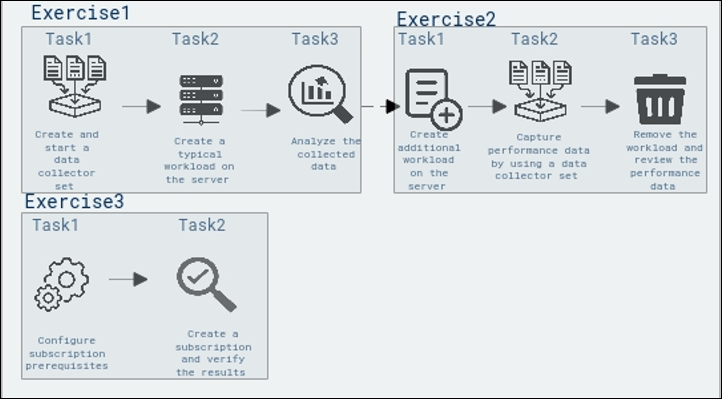

## Exercise 1: Establishing a performance baseline

> **Note**: After starting the Data Collector Set, there might be a delay of 10 minutes for the results to appear.

### Task 1: Create and start a data collector set

1. Connect to **SEA-SVR2**, and then, if needed, sign in as **CONTOSO\\Administrator** with the password **Pa55w.rd**.

1. On **SEA-SVR2**, in the **Type here to search** text box next to the **Start** button, enter **Perf (1)**, and then, in the **Best match** list, select **Performance Monitor (2)**.

   

1. In Performance Monitor, expand the **Data Collector Sets** node in the navigation pane, and then select **User Defined**.

1. Right-click on the **User Defined**, select **New**, and then select **Data Collector Set**. This will launch the **Create new Data Collector Set** wizard.

1. On the **How would you like to create this new data collector set?** page of the **Create new Data Collector Set** wizard, enter **SEA-SVR2 Performance** in the **Name** box.

1. Select the **Create manually (Advanced)** option, and then select **Next**.

1. On the **What type of data do you want to include?** page, select the **Performance counter** checkbox, and then select **Next**.

1. On the **Which performance counters would you like to log?** page, select **Add**.

1. In the **Available counters (1)** list, expand **Processor (2)**, select **% Processor Time (3)**, ensure that the **_Total (4)** entry is selected in the **Instances of selected object (5)** section, and then select **Add >> (6)**.

   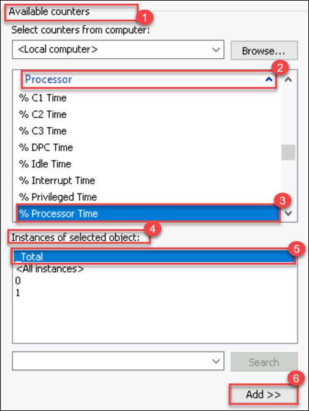

1. In the **Available counters (1)** list, expand **Memory (2)**, select **Pages/sec (3)**, and then select **Add >> (4)**.

1. In the **Available counters (1)** list, expand **PhysicalDisk (2)**, select **% Disk Time (3)**, ensure that the **_Total (4)** entry is selected in the **Instances of selected object (5)** section, and then select **Add >> (6)**.

   

1. Select **Avg. Disk Queue Length (1)**, ensure that the **_Total (2)** entry is selected in the **Instances of selected object** section, and then select **Add >> (3)**.

   

1. In the **Available counters (1)** list, expand **System**, select **Processor Queue Length (2)**, and then select **Add >> (3)**.

   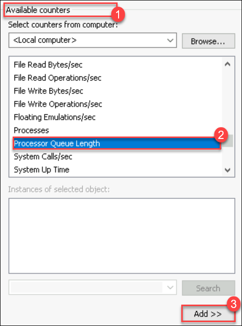

1. In the **Available counters (1)** list, expand **Network Interface (2)**, select **Bytes Total/sec (3)**, ensure that the **All instances (4)** entry is selected in the **Instances of selected object (5)** section, select **Add >> (6)**, and then select **OK (7)**.

   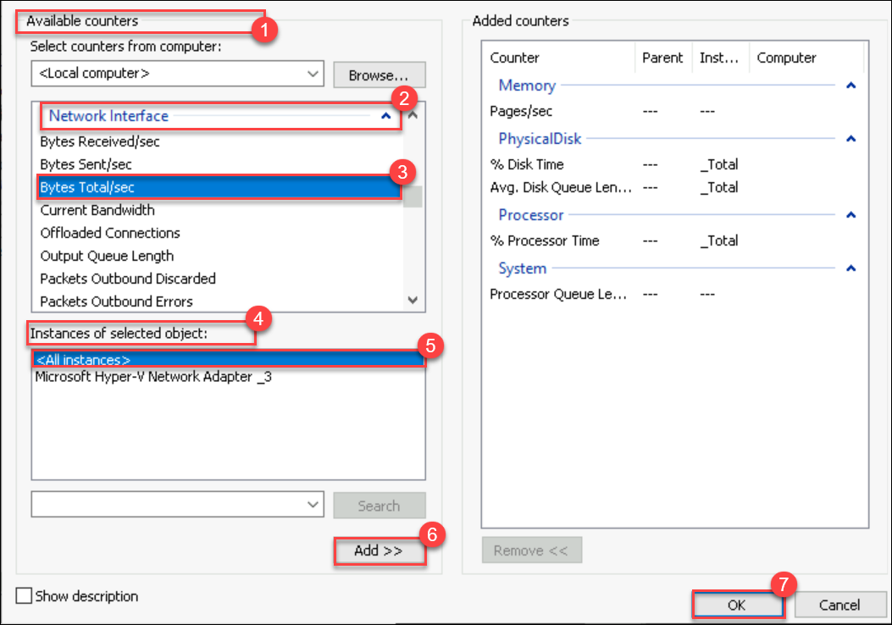

1. On the **Which performance counters would you like to log?** page, enter **1 (1)** in the **Sample interval** box, and then select **Next (2)**.

   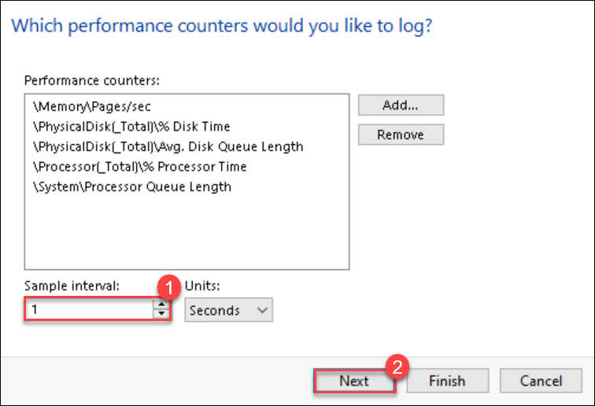

1. On the **Where would you like the data to be saved?** page, select **Next**.

1. On the **Create the data collector set?** page, ensure that the **Save and close** option is selected, and then select **Finish**.

   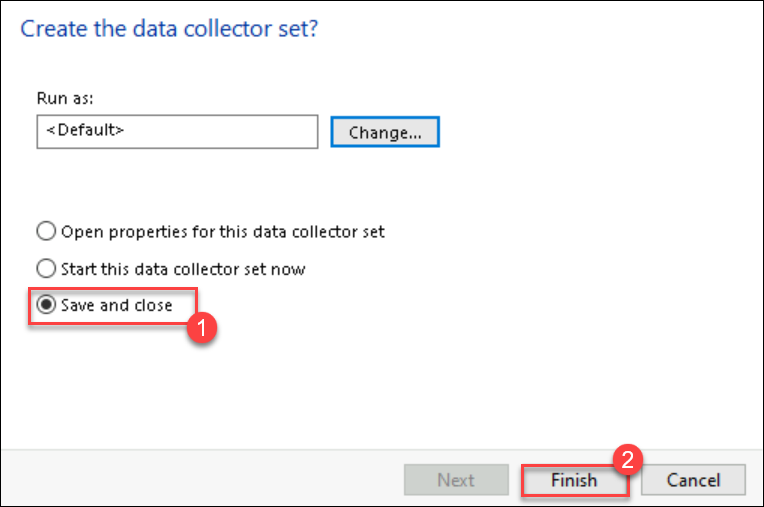

1. In Performance Monitor, in the results pane, right-click on the **SEA-SVR2 Performance (1)**, and then select **Start (2)**.

   

### Task 2: Create a typical workload on the server

1. On **SEA-SVR2**, in the **Type here to search** text box next to the **Start** button, search for **Windows PowerShell**, right-click on the **Windows PowerShell** and then select **Run as administrator**.

1. To create a file of a specific size, at the Windows PowerShell command prompt, enter the following command and press Enter:

   ```powershell
   fsutil file createnew bigfile 104857600
   ```

1. To copy the newly created file to the root of drive **C** of **SEA-DC1**, enter the following command and press Enter:

   ```powershell
   Copy-Item -Path .\bigfile -Destination \\SEA-DC1.contoso.com\c$\ -Force
   ```

1. To copy the file from the root of drive **C** of **SEA-DC1** to the current working directory, enter the following command and press Enter:

   ```powershell
   Copy-Item -Path \\SEA-DC1.contoso.com\c$\bigfile -Destination .\bigfile2 -Force
   ```

1. To delete both files in the current working directory, enter the following command and press Enter:

   ```powershell
   Remove-Item -Path .\bigfile* -Force
   ```

1. To delete the file in the root of drive **C** of **SEA-DC1**, enter the following command and press Enter:

   ```powershell
   Remove-Item -Path \\SEA-DC1.contoso.com\c$\bigfile -Force
   ```

1. Leave the Windows PowerShell window open.

### Task 3: Analyze the collected data

1. On **SEA-SVR2**, switch to Performance Monitor.

1. In the navigation pane, right-click or access the context menu for **SEA-SVR2 Performance (1)**, and then select **Stop (2)**.

   

1. In Performance Monitor, in the navigation pane, expand **Reports (1)**, expand **User Defined (2)**, expand **SEA-SVR2 Performance (3)**, select **SEA-SVR2\_*DateTime*-000001 (4)** 

   >**Note:** (where *DateTime* designates the current timestamp), and then review the report data.

   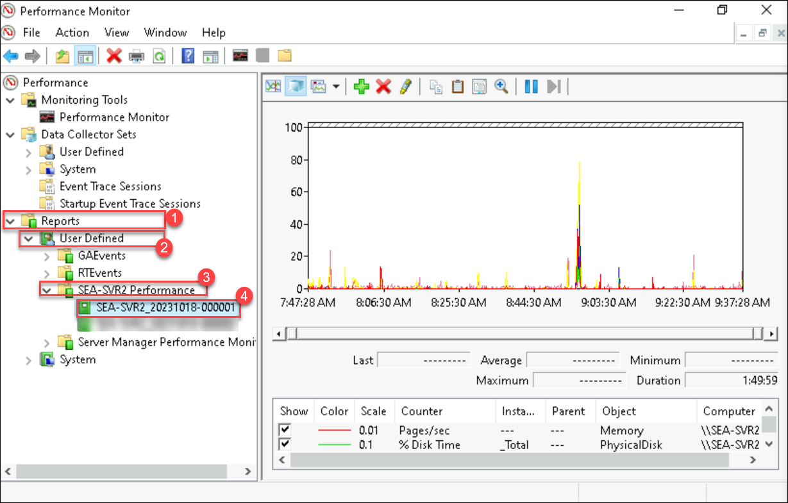

1. On the menu bar, select **Change graph type** or press Ctrl+G, and then select **Report**.

   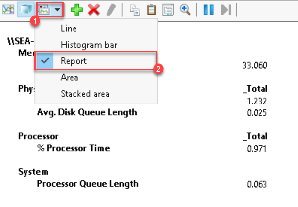

1. Record the values that are listed in the report for later analysis. Recorded values include:

   - **Memory\\Pages/sec**
   - **Network Interface\\Bytes Total/sec**
   - **PhysicalDisk\\% Disk Time**
   - **PhysicalDisk\\Avg. Disk Queue Length**
   - **Processor\\% Processor Time**
   - **System\\Processor Queue Length**

      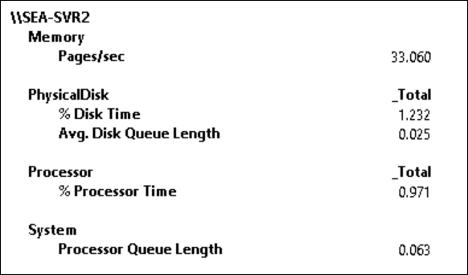

### Exercise 2: Identifying the source of a performance problem

#### Task 1: Create additional workload on the server

1. On **SEA-SVR2**, open File Explorer.

1. In File Explorer, browse to **C:\Labfiles\Lab08**.

1. Double-click on **CPUSTRES64.EXE**.

   >**Note**: **CPUSTRES64.EXE** is a SysInternals utility that can be used to simulate CPU activity by running up to 64 threads in a loop.

1. In the **CPUSTRES License Agreement** dialog box, select **Agree**.

1. In the **CPU Stress** dialog box, right-click on the highlighted thread at the top of the list of running threads, select **Activity Level**, and then select **Busy (75%)**.

   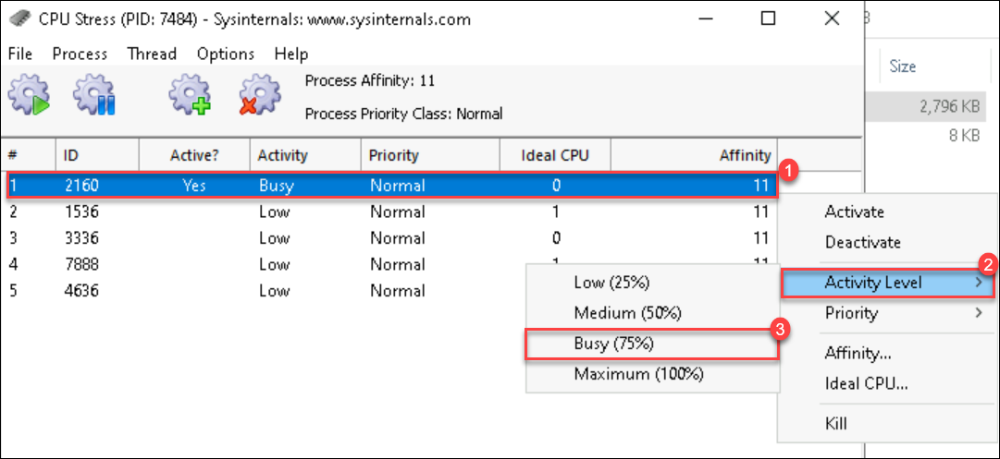

#### Task 2: Capture performance data by using a data collector set

1. On **SEA-SVR2**, switch to Performance Monitor.

1. In Performance Monitor, expand **Data Collector Sets**, and select **User Defined**.

1. In the results pane, right-click or access the context menu for **SEA-SVR2 Performance**, and then select **Start**.

   

   > **Note**: Wait 1 minute to allow the data capture to occur.

#### Task 3: Remove the workload and review the performance data

1. On **SEA-SVR2**, switch to **CPU Stress** dialog box and close it. 

1. Switch to Performance Monitor.

1. In the navigation pane, right-click on the **SEA-SVR2 Performance**, and then select **Stop**.

   

1. In Performance Monitor, in the navigation pane, expand **Reports (1)**, expand **User Defined (2)**, expand **SEA-SVR2 Performance (3)**, select **SEA-SVR2\_*DateTime*-000002 (4)** (where *DateTime* designates the current timestamp), and then review the report data.

1. On the menu bar, select **Change graph type (5)** or press Ctrl+G, and then select **Report (6)**.

   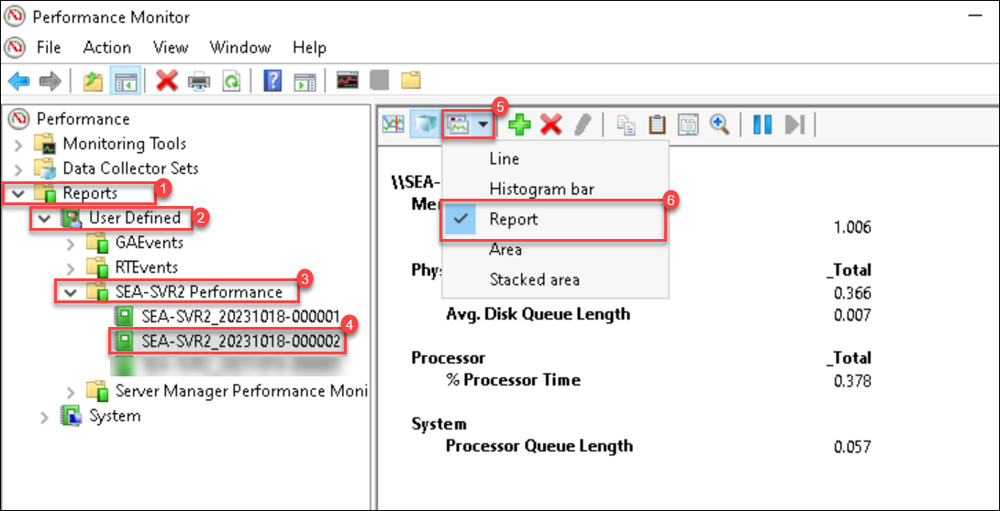

1. As before, record the values that are listed in the report. Recorded values include:

   - **Memory\\Pages/sec**
   - **Network Interface\\Bytes Total/sec**
   - **PhysicalDisk\\% Disk Time**
   - **PhysicalDisk\\Avg. Disk Queue Length**
   - **Processor\\% Processor Time**
   - **System\\Processor Queue Length**

      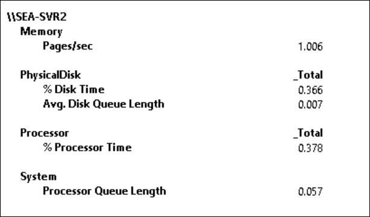

### Exercise 3: Viewing and configuring centralized event logs

#### Task 1: Configure subscription prerequisites

1. On **SEA-SVR2**, switch to Windows PowerShell.

1. To enable creating and managing subscriptions of events forwarded to **SEA-SVR2**, enter the following command and press Enter:

   ```powershell
   WECUtil qc /q
   ```

1. To ensure that the event source and collector have their local date and time synchronized, enter the following command and press Enter:

   ```powershell
   w32tm /resync /computer:SEA-DC1.contoso.com
   ```

1. To allow WinRM connectivity in case of Kerberos authentication issues, enter the following command and press Enter:

   ```powershell
   Set-Item WSMan:localhost\client\trustedhosts -Value *.contoso.com -Force
   ```

1. To establish a PowerShell Remoting session to **SEA-DC1**, enter the following command and press Enter:

   ```powershell
   Enter-PSSession -ComputerName SEA-DC1.contoso.com
   ```

1. To ensure that Windows Remote Management (WinRM) is enabled on **SEA-DC1**, enter the following command and press Enter:

   ```powershell
   winrm qc
   ```

   > **Note**: Verify that the WinRM service is already running and that it's set up for remote management.

   

1. To ensure that the relevant Windows Defender Firewall with Advanced Security rules are enabled on **SEA-DC1**, enter the following command and press Enter:

   ```powershell
   Set-NetFirewallRule -DisplayGroup 'Remote Event Log Management' -Enabled True -Profile Domain -PassThru
   ```

   > **Note**: Leave the Windows PowerShell window open.

1. On **SEA-SVR2**, in the **Type here to search** text box next to the **Start** button, enter **Active**, and then, in the **Best match** list, select **Active Directory Users and Computers**.

   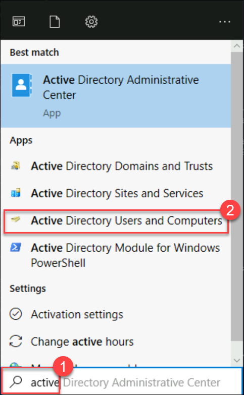

1. In the **Active Directory Users and Computers** console, select the **Builtin** container. 

1. In the **Builtin (1)** container, select the **Event Log Readers (2)** group.

    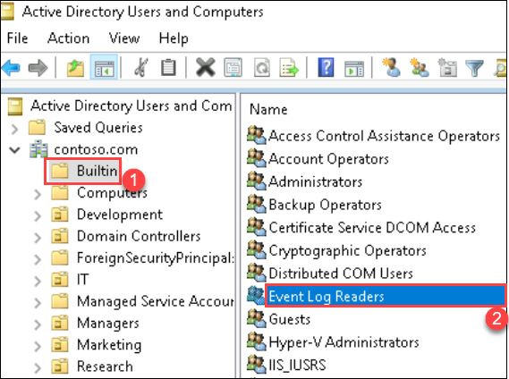

1. Right-click on the **Event Log Readers** group, select **Properties (3)**, and then, in the **Event Log Readers Properties** dialog box, select the **Members** tab.

    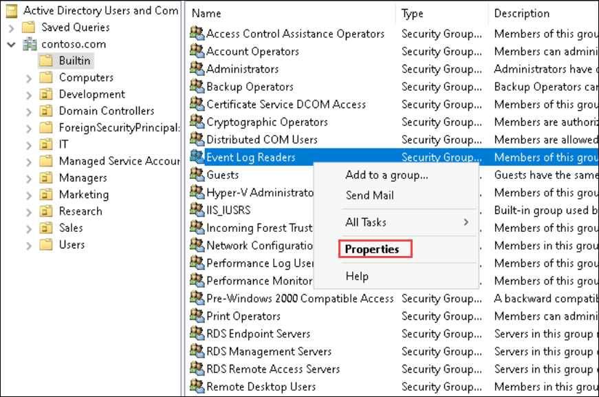

1. On the **Members** tab, select **Add**.

    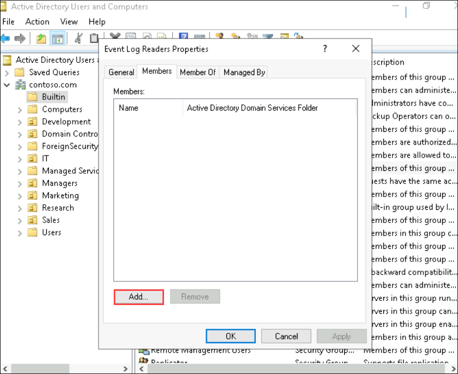

1. In the **Select Users, Contacts, Computers, Service Accounts or Groups** dialog box, select **Object Types**.

1. In the **Object Types** dialog box, select the **Computers** checkbox, and then select **OK**.

   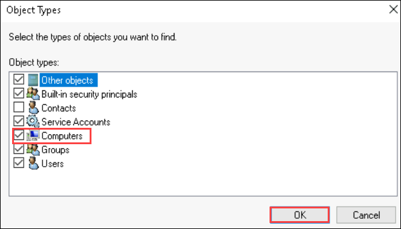

1. In the **Select Users, Computers, Service Accounts or Groups** dialog box, enter **SEA-SVR2** in the **Enter the object names to select** box, and then select **OK**.

    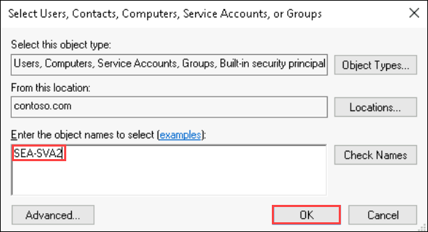

1. In the **Event Log Readers Properties** dialog box, select **OK**.

#### Task 2: Create a subscription and verify the results

1. On **SEA-SVR2**, in the **Type here to search** text box next to the **Start** button, enter **Event**, and then, in the **Best match** list, select **Event Viewer**.

1. In **Event Viewer**, select **Subscriptions** in the navigation pane.

1. Right-click or access the context menu for **Subscriptions (1)**, and then select **Create Subscription (2)**.

   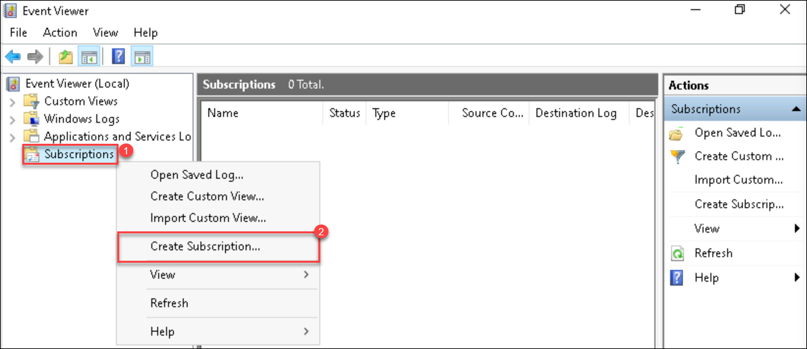

1. In the **Subscription Properties** dialog box, enter **SEA-DC1 Events** in the **Subscription name** box.

1. Ensure that the **Collector initiated** option is selected, and then select **Select Computers**.

1. In the **Computers** dialog box, select **Add Domain Computers**.

1. In the **Select Computer** dialog box, enter **SEA-DC1** in the **Enter the object name to select** box, and then select **OK**.

1. In the **Computers** dialog box, select **OK**.

1. In the **Subscription Properties – SEA-DC1 Events** dialog box, select **Select Events**.

1. In the **Logged** drop-down list, select **Last 24 hours**.

1. In the **Event level** dialog box, select the **Critical**, **Error**, **Warning**, and **Information** checkboxes.

1. In the **Event logs** drop-down list, expand **Windows Logs**, and then select the **System** and **Application** checkboxes.

    

1. In the **Query Filter** dialog box, select **OK**.

1. Back in the **Subscription Properties – SEA-DC1 Events** dialog box, select **OK**.

1. On **SEA-SVR2**, switch to the **Event Viewer** window, and then expand **Windows Logs** in the navigation pane.

1. Select **Forwarded Events** and verify that the forwarded events include those generated on **SEA-DC1**.

   >**Note:** You have to wait for sometime, till the results shows.

### Review
In this lab, you have completed:
- Established a performance baseline.
- Identified the source of a performance problem.
- Viewied and configured centralized event logs.

### You have successfully completed the lab
